```{=html}
<script>
document.addEventListener("DOMContentLoaded", function(){
  var tooltipTriggerList = [].slice.call(document.querySelectorAll('[data-bs-toggle="tooltip"]'))
  tooltipTriggerList.map(function (tooltipTriggerEl) {
    return new bootstrap.Tooltip(tooltipTriggerEl)
  })
})
</script>
```

## 1. Evolution régionale de la vacance de logements entre 2011 et 2022 (Chiffres INSEE)

### 1.1 Évolution du nombre de logements par catégorie en historique depuis 1968

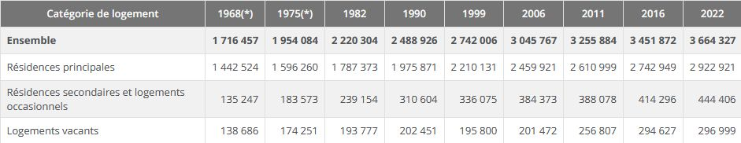{.lightbox}

```{r echo=FALSE, warning=FALSE }
#| fig-align: "center"

library(ggplot2)

df <- data.frame(
  annee = c(1968, 1975, 1982, 1990, 1999, 2006, 2011, 2016, 2022),
  nb_vacants = c(138686, 174251, 193777, 202451, 195800, 201472, 256807, 254627, 296999),
  taux_vacance = c(8.1, 8.9, 8.7, 8.1, 7.1, 6.6, 7.9, 8.5, 8.1)
)

coef <- max(df$nb_vacants) / max(df$taux_vacance)

ggplot(df, aes(x = annee)) +
  geom_line(aes(y = nb_vacants, colour = "Nombre de logements vacants"),
            linewidth = 1.4) +
  geom_point(aes(y = nb_vacants, colour = "Nombre de logements vacants"),
             size = 2.5) +
  geom_line(aes(y = taux_vacance * coef, colour = "Taux de vacance (%)"),
            linewidth = 1.4, linetype = "solid") +
  geom_point(aes(y = taux_vacance * coef, colour = "Taux de vacance (%)"),
             size = 2.5) +
  
  scale_y_continuous(
    name = "Nombre de logements vacants",
    sec.axis = sec_axis(~ . / coef, name = "Taux de vacance (%)")
  ) +
  
  scale_colour_manual(
    values = c(
      "Nombre de logements vacants" = "#1f78b4",
      "Taux de vacance (%)" = "#e31a1c"
    )
  ) +
  
  labs(
    x = "Année",
    colour = "Indicateur",
    title = "Évolution du nombre et du taux de logements vacants",
    subtitle = "Nouvelle-Aquitaine, 1968–2022"
  ) +
  
  theme_minimal(base_size = 15) +
  theme(
    plot.title = element_text(face = "bold", size = 16),
    plot.subtitle = element_text(size = 14, margin = margin(b = 10)),
    axis.title.y = element_text(color = "#1f78b4", face = "bold"),
    axis.title.y.right = element_text(color = "#e31a1c", face = "bold"),
    legend.position = "bottom",
    legend.title = element_text(face = "bold"),
    legend.box = "horizontal",
    panel.grid.minor = element_blank()
  )


```

```         
• (*) 1967 et 1974 pour les DOM
• Les données proposées sont établies à périmètre géographique identique, dans la géographie en vigueur au 01/01/2025.
• Sources : Insee, RP1967 au RP1999 dénombrements, RP2006 au RP2022 exploitations principales
```

#### 1.1.1 Catégories de logements

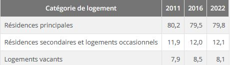{.lightbox}

```         
• Sources : Insee, RP2011, RP2016 et RP2022, exploitations principales, géographie au 01/01/2025 
```

## 2. Evolution regionale de la vacance selon lovac

### 2.1 Nombre et part de logements vacants de plus de 2 ans entre 2020 et 2024

Evolution du nombre de logements vacants entre 2020 et 2024 en France + 3,6 % de 1,11M à 1,15M (2025 + 20,7 % soit 1,35M à plus de 2 ans mais -35 % au total) La vacance structurelle a évolué deux fois moins vite en Nouvelle Aquitaine (10 points de moins 20,99 % contre 10,6%) qu’en France.

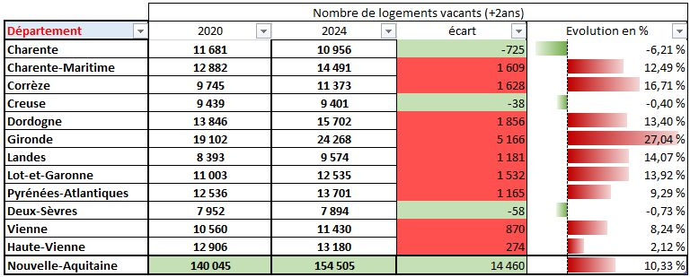{.lightbox}

### 2.2 Evolution de la part départementale

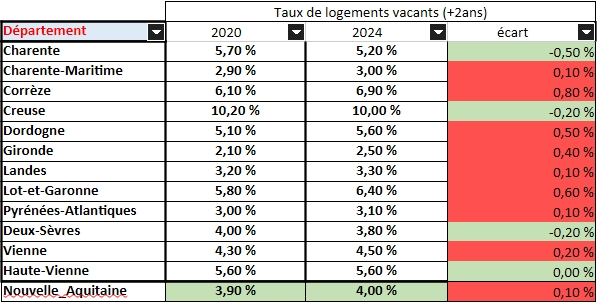{.lightbox}

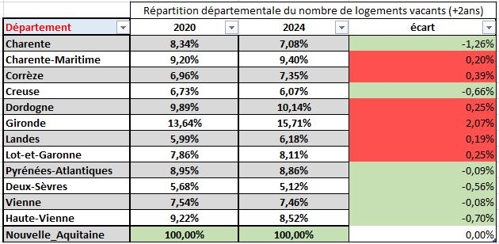{.lightbox}

Evolution du nombre de logements vacants entre 2020 et 2024 en France + 3,6 % de 1,11M à 1,15M (2025 + 20,7 % plus de 2 ans mais -35 % au total)

Méthodologie Contexte Évolution de la base de données LOVAC entre 2020 et 2025 avec l’arrivée de GMBI (Gérer Mon Bien Immobilier) depuis 2023.

LOVAC Avant 2024 : Données DGFIP (Taxe d’habitation)

LOVAC 2024 : Données GMBI + correction DGFIP avec Taxe habitation (Incidence : Légère surévaluation des résidences secondaires et des logements vacants).

LOVAC 2025 : Données brut GMBI (Diminution de 35% du parc recensé)→ Comparaison millésime 2020 et 2024. Et actualisation de l’état des lieux avec LOVAC 2025.

Les fichiers LOVAC sont obtenus par croisement de plusieurs données fiscales :

```         
    • à partir du fichier 1767bisCOM transmis par la DGFiP qui liste les locaux résidentiels (logements de dépendances) considérés vacants au 1er janvier de l’année,  
    • des Fichiers fonciers produits par le Cerema à partir des données MAJIC et PCI, et qui permettent une localisation et description fines des locaux fiscaux et une identification des propriétaires,  
    • des données DV3F (Demande de Valeur Foncières enrichies) qui apportent des informations sur les biens ayant fait l’objet d’une transaction onéreuse depuis 2010,  
    • de la BAN (Base Adresse Nationale), référentiel produit par l'IGN et la Dinum, qui permet de « redresser » les adresses mentionnées.  
```

À noter qu’entre la fin progressive de la taxe d’habitation et l’apparition du dispositif GMBI (Gérer Mon Bien Immobilier) destiné à recenser des informations sur l’occupation des locaux directement auprès des propriétaires, il est possible que les informations relatives à l’occupation des locaux diffèrent ou soient rectifiées au fil des millésimes.

### 2.3 Localisation de la vacance

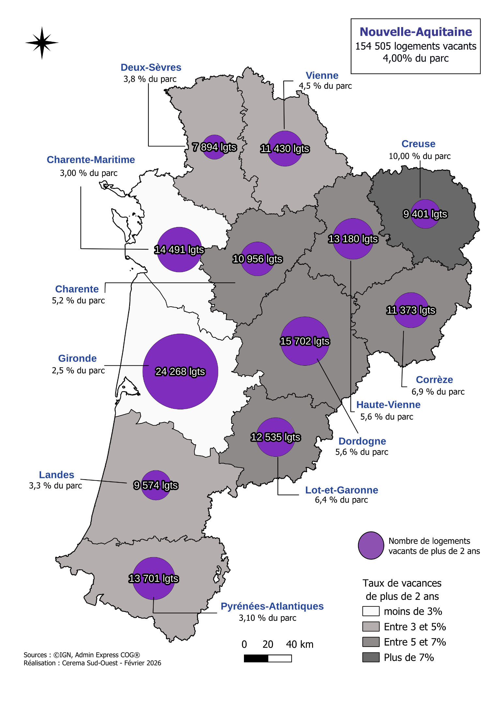{.lightbox}

### 2.4 Taux de vacance départementale

La vacance de logement est sensiblement différente d’un département à l’autre (de 2,5% en Gironde à 10% dans la Creuse) et s’établit en « dégradé » d’Ouest (Littoral) en Est et à l’intérieur (départements plus ruraux)

::: center
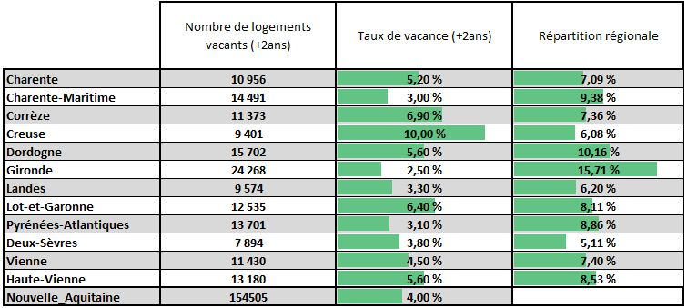{.lightbox}
:::

## 3. Caractéristiques du parc vacant

### 3.1 Par période de construction

Des logements vacants anciens Assez logiquement, on constate que le parc de logements privés vacants depuis plus de 2 ans est principalement ancien. En effet, 33% de ce parc a été construit avant 1949 alors que le taux de logements anciens dans le parc régional est de 68%. Il semble donc que la vétusté et certainement le manque d’entretien soient à l’origine de la vacance sur un nombre important de logements.\
Cette tendance est confirmée plus les logements sont récents, moins ils sont vacants proportionnellement (les logements construits après 1980 représentent 44% du par cet seulement 16% des logements vacants).

::: center
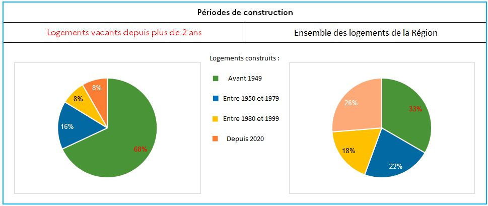{.lightbox}
:::

### 3.2 Par nature de logement

Une majorité de maisons parmi les logements vacants Il semble que la nature du logement (maison ou appartement) n’influe pas sur la vacance. En effet, 72 % des logements privés vacants depuis plus de 2 ans sont des maisons. La proportion de logements de type maisons sur la région est de 70 %.

::: center
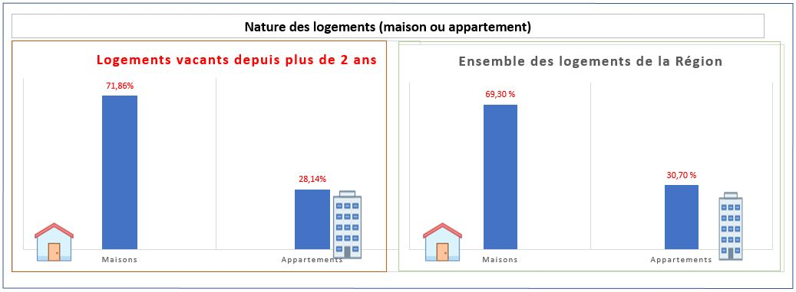{.lightbox}
:::

### 3.3 Par typologie de logements

Une sur-représentation de petits logements parmi les logements vacants Les petits logements (de **typologie [T1 ou T2]{style="cursor:pointer;" data-bs-toggle="tooltip" title="Dans cette étude, la typologie prise en compte est celle définie par les promoteurs immobiliers : le chiffre indiqué après le « T » correspond à la somme des salles à manger et des chambres présentes dans le logement."}**) représentent 40 % des logements vacants de plus de 2 ans alors qu’ils ne constituent que 22 % de l’ensemble des habitations de la région. On constate donc une sur-représentation des petits logements au détriment des plus grands (T5 et +) qui ont un taux de vacance de 16% alors qu’ils représentent 26% du parc régional.

::: center
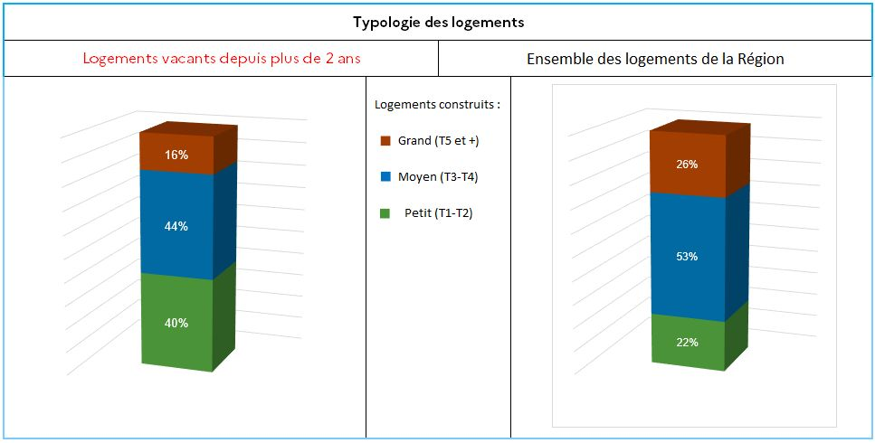{.lightbox}
:::

### 3.4 Par qualité du bâti : La qualité du bâti des logements vacants

A partir du classement [**cadastral**]{style="cursor:pointer;" data-bs-toggle="tooltip" title="Le classement cadastral est un indicateur de la qualité globale du logement selon des critères relatifs au caractère architectural du bâtiment, à la qualité de sa construction, et à ses équipements. Établi pour l’ensemble des habitations, il sert de base de la valeur locative. Chaque local en France est classé dans une des huit catégories de référence : du 1 (habitation luxueuse) à 8 (logement délabré et insalubre)."} , en considérant que les logements classés 6, 7 et 8 (retenus comme critère prépondérant dans la définition du parc potentiellement indigne) ne peuvent être remis sur le marché sans un minimum de réhabilitation, la répartition des logements du parc privé vacants depuis plus de 2 ans est la suivante :

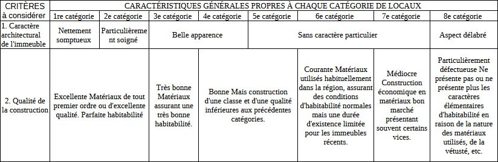{.lightbox}

::: center
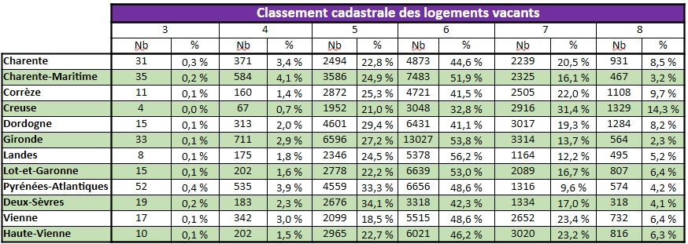{.lightbox}
:::

Il peut ainsi être considéré que 28,3% des logements vacants de plus de 2 ans pourraient être remis sur le marché sans travaux (classement 3,4,5), voire prés des ¾ (Pyrénées-Atlantiques, Gironde, Landes, Charente-Maritime comportant plus de 80%,) en incluant le classement 6 des immeubles sans caractère et de qualité courante, avec peu de travaux .

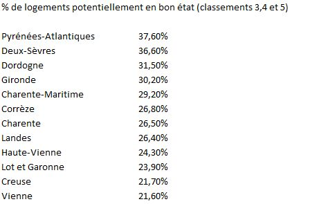{.lightbox}

Territorialement, ce parc de logements vacants de plus de 2 ans ne nécessitant à priori pas de travaux lourds est présent sur l’ensemble de la région : A la lecture du tableau ci-dessus, il semble que plus d’un tiers du parc des logements vacants des Deux-Sèvres et des Pyrénées-Atlantiques puisse être remis sur le marché à moindre coût. A l’inverse, dans la Vienne ou la Creuse, le parc vacant semble globalement plus dégradé.

### 3.5 Par localisation dans les communes : La localisation des logements du parc privé vacants depuis plus de 2 ans

Afin de définir les actions à mener par les services de l’État et les collectivités sur les logements vacants de longue durée pour les remettre sur le marché locatif, il a été défini trois zones dans lesquelles pouvait se trouver un logement privé vacant :

```{=html}
<ul>
  <li>une zone centre, dans <span style="cursor:pointer; font-weight:bold;" data-bs-toggle="tooltip" title="Enveloppe urbaine : zone constituée par un bâti continu, dont la définition précise est à retrouver en annexe du document.">l’enveloppe urbaine</span> du territoire et à moins de 500 m d’un <span style="cursor:pointer; font-weight:bold;" data-bs-toggle="tooltip" title="Les points d’intérêt retenus sont les mairies, les lieux de cultes et les écoles primaires et maternelles."> point d’intérêt</span></li>
  <li>une zone péri-centre, dans l’enveloppe urbaine du territoire et comprise entre 500 m et 1000 m d’un point d’intérêt ;</li>
  <li>une zone hors agglomération, extérieure aux deux zones précédentes.
La méthodologie de la définition de ces trois zones est à retrouver en annexe du document.</li>
</ul>
```

La méthodologie de la définition de ces trois zones est à retrouver en annexe du document.

::: center
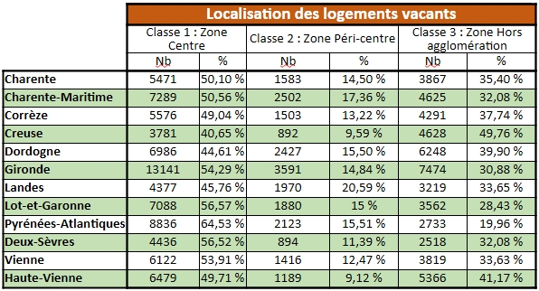{.lightbox}
:::

A l’échelle régionale 51,7% des logements vacants sont situés en zone centre et 14,3% en zone péricentrale soit 66% du parc (les 2/3)

A l’échelle régionale 51,7% des logements vacants sont situés en zone centre et 14,3% en zone péricentrale soit 66% du parc (les 2/3) est situé à moins de 1 km d’un centre d’intérêt.

Cette centralité de la vacance est plus caractérisée dans certaines départements (Pyrénées-Atlantiques 80%, Lot et Garonne 71,6%, Gironde 69,1%) que dans d’autres (Creuse 50,2%, Haute-Vienne 58,8%, Dordogne 60,1%)
