```{=html}
<style>
  p {
  text-align: inherit !important;
  }

.img-stack {
  position: relative;
  width: 100%;
  max-width: 900px;
  margin: auto;
  aspect-ratio: 3 / 1; /* hauteur fluide */
}

/* Images superposées */
.img-stack img {
  position: absolute;
  object-fit: contain;
  max-width: 100%;
  margin-top: -65px;
}

/* Image du dessus */
.img-top {
  width: 60%;
  right: 2%;
  top: 0;
}

/* Image du dessous */
.img-bottom {
  width: 40%;
  right: 35%;
  top: 15%;
}

/* --- Responsive fluide --- */
@media (max-width: 900px) {
  .img-top {
    width: 65%;
    right: 0;
    top: 5%;
  }
  .img-bottom {
    width: 45%;
    right: 30%;
    top: 20%;
  }
}

@media (max-width: 600px) {
  .img-top {
    width: 70%;
    right: 0;
    top: 10%;
  }
  .img-bottom {
    width: 50%;
    right: 25%;
    top: 25%;
  }
}

@media (max-width: 450px) {
  .img-top {
    width: 75%;
    right: 0;
    top: 15%;
  }
  .img-bottom {
    width: 55%;
    right: 20%;
    top: 30%;
  }
}

  
  .triple-overlap {
    position: relative;
    width: 100%;
    display: flex;
    justify-content: center; /* centre le groupe */
    align-items: center;
    text-align: center;
  }

  .triple-overlap img {
    width: 36%; /* taille des images */
  }

  /* Image de gauche */
  .img-left {
    position: relative;
    z-index: 1;
  }

  /* Image du milieu (au-dessus) */
  .img-middle {
    position: relative;
    z-index: 3; /* passe au-dessus */
    margin: 0 -6%; /* chevauchement horizontal */
    margin-top: -4%; /* chevauchement vertical */
  }

  /* Image de droite */
  .img-right {
    position: relative;
    z-index: 1;
  }

  /* Responsive */
  @media (max-width: 800px) {
    .triple-overlap img {
      width: 35%;
    }
    .img-middle {
      margin: 0 -8%;
      margin-top: -6%;
    }
  }

  @media (max-width: 500px) {
    .triple-overlap img {
      width: 45%;
    }
    .img-middle {
      margin: 0 -10%;
      margin-top: -8%;
    }
  }
</style>
```


<p style="display:flex; justify-content:center !important;">
  {.no-figure style="width:62%;"}
</p>

## 1. Contexte et objet de l’étude
::: {style="font-family: YACkoD1yZN0-0;font-size:1.1em;"}
La vacance est un enjeu majeur du logement aujourd’hui largement pris en compte dans les politiques locales pour la production de logements, mais une vacance structurelle, longue (2 ans et plus) persiste souvent sur les territoires : elle n’est pas négligeable. Cette vacance est conséquente sur les villes moyennes hors littoral, les petites villes et dans la ruralité.

Dans un contexte général de nécessité de produire des logements dans l’existant afin de garantir une meilleure gestion économe du foncier, la résorption de la vacance s’impose ainsi toujours comme un enjeu majeur.

La présente **étude élaborée conjointement entre le Cerema et la DREAL Nouvelle Aquitaine** a vocation à présenter un état des lieux de la vacance sur la région Nouvelle-Aquitaine sur la base [**LOVAC**]{style="cursor:pointer; color: #42429f;" data-bs-toggle="tooltip" title="Voir annexes"} actualisée du Ministère des Finances, suite aux évolutions de cette dernière (mise en place d’une refonte du calcul avec l’outil «GMBI» Gestion de mon bien immobilier d’après la déclaration des propriétaires fonciers et évolution des méthodes de recensement).
L’étude présente la situation régionale, les tendances générales et les évolutions de la vacance de longue durée ces dernières années puis une analyse fine et territorialisée de la vacance avec des documents complémentaires (non joints dans le présent document) :

<div style="padding-left: 25px;">
• **Une matrice (document type calc/excel) détaillant** les chiffres LOVAC de la vacance selon les caractéristiques des logements ([**EPCI**]{style="cursor:pointer; color:#42429f;" data-bs-toggle="tooltip" title="Etablissement public de coopération intercommunale"} et niveau communal) :
</div>

<div style="border: 1px solid; padding-left: 5px;">
**Les caractéristiques des logements vacants présentés dans la matrice : **   
❖ nombre et part de logements vacants depuis plus de 2 ans,\
❖ durée de vacance,\
❖ typologie du parc (type de logement, année de construction)\
❖ localisation (à définir en lien avec le maître d’ouvrage)\
❖ qualité du bâti\
❖ ...
</div>

<div class="img-stack">
  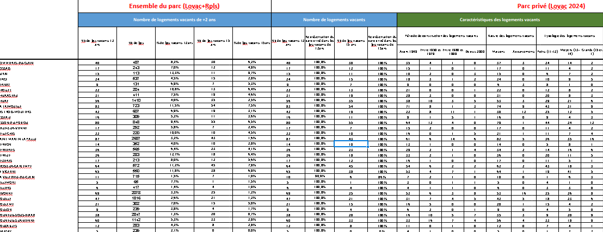
  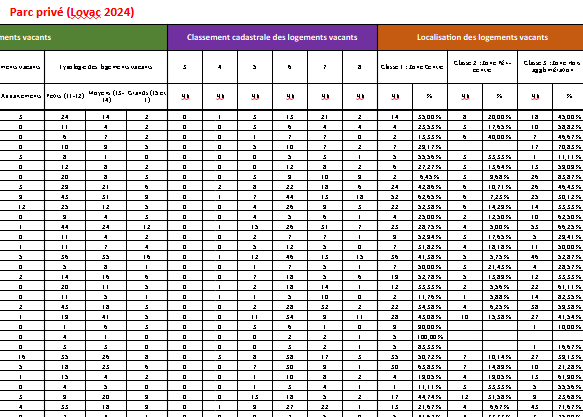
</div>


<div style="padding-left: 25px;">
• **Une cartographie de la vacance pour 70 villes, à l’échelle des [quartiers]{style="cursor:pointer; color:#42429f;" data-bs-toggle="tooltip" title="liste des communes cartographiées dans la rubrique «Cartographie des logements vacants : IRIS» "}**
</div>

<div class="triple-overlap">
  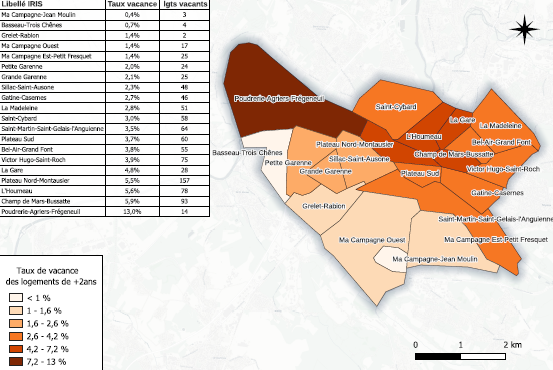
  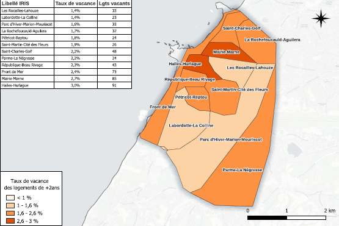
  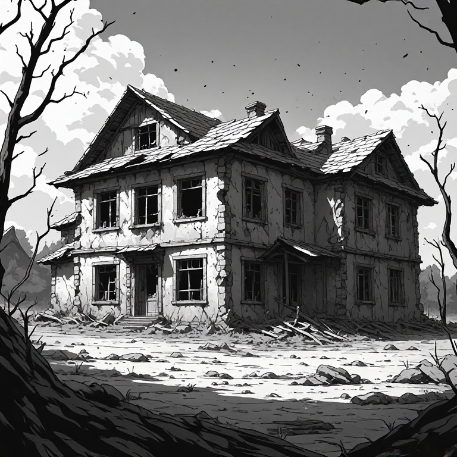
</div>

<div style="padding-left: 25px;">
• **Deux documents annexes : un premier** qui propose une liste la plus exhaustive possible des outils et leviers existants pour lutter contre la vacance (repérage, outils opérationnels, coercitifs, financiers, procédures, outils programmatiques…). Un second document annexe présentant un court guide court à destination des DDTM dans leur dialogue à destination des élus (pourquoi lutter contre la vacance, quel type de vacance, quels outils et quelle démarche engager ?). Ces deux derniers documents ne sont disponibles que pour les services de l’État.
</div>

<div style="border:1px solid; padding:5px;">
<p style="text-align:center !important; color:#a87d2f; font-weight:bold;">Une étude qui cible la vacance de longue durée, dite structurelle : définitions</p>
<p>
La **vacance structurelle** correspond à une inoccupation qui se prolonge en raison d’obstacles à l’occupation ou à la remise sur le marché du logement. Ces obstacles peuvent tenir au bien lui-même — dégradation, travaux importants, caractéristiques inadaptées à la demande —, au contexte immobilier local — demande insuffisante notamment — ou à la situation du propriétaire : succession bloquée, difficultés financières, réticence à louer ou maintien volontaire du bien hors du marché. **Elle ne résulte donc pas seulement de la rotation ordinaire des occupants.** La notion de vacance strucurelle se rapproche de la notion de vacance de longue durée  (plus de deux ans) qui est une catégorie définie par la **durée d’inoccupation**, plutôt que directement par ses causes. Dans LOVAC, le seuil de **plus de deux ans** est retenu pour repérer les logements du parc privé présumés relever de la vacance structurelle, notamment pour orienter les actions de remise sur le marché.  

**Ce seuil constitue une convention de repérage, pas une frontière absolue** : un logement vacant depuis moins de deux ans peut déjà présenter des blocages structurels ; inversement, dépasser deux ans ne suffit pas à déterminer la cause de la vacance. Il est à noter que, dans les fichiers fiscaux, la vacance de plus de deux ans correspond à un logement identifié comme vacant **à au moins trois 1er janvier consécutifs.** Cette observation ne garantit pas l’absence de toute occupation entre ces dates dans LOVAC.  

La **vacance frictionnelle**, ou **vacance de rotation**, correspond à l’inoccupation temporaire d’un logement entre deux occupants : départ d’un ménage, recherche d’un nouveau locataire ou acquéreur, vente, délai d’installation et éventuelle remise en état. Généralement de courte durée — quelques jours à quelques mois —, elle accompagne le fonctionnement du marché et la mobilité résidentielle. Elle ne traduit pas nécessairement une difficulté durable à remettre le logement en occupation.
</p>
</div>

<div class="triple-overlap" style="margin-top:10px;">
  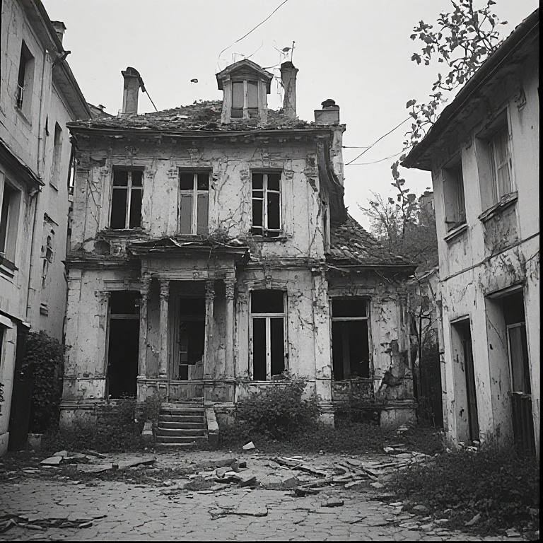
  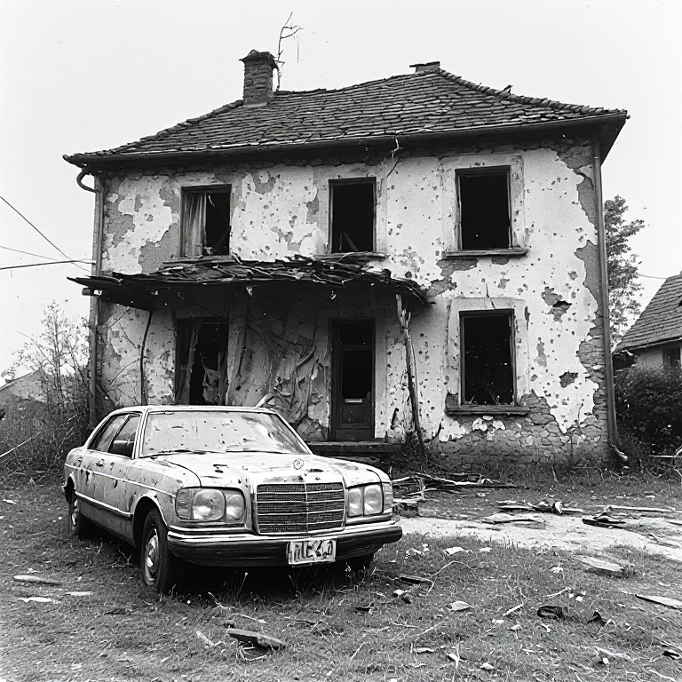
  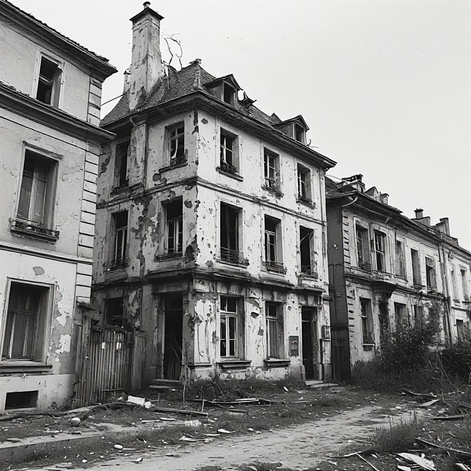
</div>
:::


## 2. L’évolution de la vacance globale des logements
### 2.1 Précautions méthodologiques
::: {style="font-family: YACkoD1yZN0-0;font-size:1.1em;"}
  Deux sources complémentaires sont mobilisées dans cette étude : les données du recensement de la population de l’Insee pour analyser l’évolution de la vacance totale, et les données [**LOVAC**]{style="cursor:pointer; color: #42429f;" data-bs-toggle="tooltip" title="Voir annexes"} pour caractériser la vacance du parc privé à un millésime donné. Des travaux locaux peuvent compléter cette approche, notamment par le croisement de sources et la vérification des situations sur le terrain. Le recensement INSEE ne renseigne toutefois pas la durée d’inoccupation : il ne permet donc pas, à lui seul, de distinguer la vacance de rotation des situations durablement bloquées.  
  
**Les comparaisons brutes entre les millésimes LOVAC traversant les ruptures de série ne sont pas pertinentes pour mesurer l’évolution de la [vacance]{style="cursor:pointer; color: #42429f;" data-bs-toggle="tooltip" title="Les données LOVAC mettent en évidence l’ampleur de la vacance de longue durée dans le parc privé : le millésime 2024 identifie environ 1,15 million de logements vacants depuis plus de deux ans à l’échelle nationale, et le millésime 2025 environ 1,35 million. Ces dénombrements ne peuvent toutefois pas être interprétés directement comme une augmentation réelle de la vacance, en raison des ruptures de série liées au passage à GMBI puis aux modifications de traitement intervenues en 2025. Cette réserve concerne aussi bien l’échelle nationale que les échelles locales. Les données permettent de caractériser un stock important de logements identifiés comme durablement vacants, mais leur comparaison brute ne permet pas d’en établir l’évolution (ni avec des millésimes antérieurs, 2023, 2022, 2021, 2020) pour des raisons de ruptures de méthode également."}**. Le passage aux déclarations d’occupation GMBI à partir du millésime 2024, puis les modifications de sélection des logements intervenues en 2025, affectent leur comparabilité. Cette réserve concerne aussi bien l’échelle nationale que les échelles locales.  

**Le recensement constitue ainsi la principale référence commune retenue ici pour l’analyse des tendances.** Ses résultats doivent néanmoins être interprétés en tenant compte des évolutions de la [**collecte**]{style="cursor:pointer; color: #42429f;" data-bs-toggle="tooltip" title="En particulier, le protocole « boîte aux lettres », généralisé en 2022, a un effet sur la répartition entre résidences principales et logements vacants, progressivement intégré aux résultats. Les variations récentes ne peuvent donc pas être attribuées intégralement à des évolutions du marché du logement."}.
:::

### 2.2 En Nouvelle-Aquitaine : une forte hausse de la vacance entre 2006 et 2016, suivie d’une quasi-stabilisation de 2016 à 2022

::: {style="font-family: YACkoD1yZN0-0;font-size:1.1em;"}
D’après les données du recensement, le nombre de logements vacants en Nouvelle-Aquitaine fluctue autour de 200 000 entre 1982 et 2006. Leur part dans l’ensemble du parc diminue sur cette période, passant de **8,73 % à 6,61 %.** Entre **2006 et 2016**, leur nombre augmente fortement, de **201 472 à 294 627**, et leur part atteint **8,54 %.**  

Entre **2016 et 2022**, le nombre de logements vacants se stabilise presque : il augmente de **0,8 %**, pour atteindre **296 999 logements**, alors que l’ensemble du parc progresse de **6,2 %**. Le taux de vacance mesuré diminue donc de **0,43 point**, à **8,11 %.** Sur l’ensemble de la période **2006–2022**, les effectifs restent cependant en hausse de **47,4 %**, et le taux supérieur d’environ **1,5 point** à son niveau de 2006.  

La tendance régionale se traduit donc par une hausse importante au cours de la décennie 2006–2016 puis une quasi-stabilisation des effectifs et un recul de leur part entre 2016 et 2022.

<div style="text-align:center; font-weight:bold;">
Évolution du nombre de logements par catégorie en historique pour la Nouvelle-Aquitaine
</div>

```{=html}
<style>
  /* --- Wrapper pour scroll horizontal fluide --- */
.table-wrapper {
  overflow-x: auto;
  overflow-y: hidden;
  -webkit-overflow-scrolling: touch;
  width: 100%;
}

/* --- Tableau --- */
table.parc-logements {
  width: 100%;
  border-collapse: collapse;
  font-size: 15px;
  min-width: 1100px; /* empêche la compression excessive */
}

/* En-tête gris foncé */
table.parc-logements thead tr {
  background: #444;
  color: white;
}

/* Cellules */
table.parc-logements th,
table.parc-logements td {
  padding: 8px 12px;
  border: 1px solid #ddd;
  text-align: left;

  /* Empêche le débordement */
  white-space: normal;
  word-break: break-word;

  /* Empêche la disparition des colonnes */
  min-width: 90px;
}

/* Alternance gris clair / blanc */
table.parc-logements tbody tr:nth-child(odd) {
  background: #f7f7f7;
}
table.parc-logements tbody tr:nth-child(even) {
  background: #ffffff;
}

/* --- Mobile : texte légèrement plus petit --- */
@media (max-width: 600px) {
  table.parc-logements {
    font-size: 14px;
  }
}
</style>

<div class="table-wrapper">
<table class="parc-logements">
  <thead>
    <tr>
      <th>Catégorie de logement</th>
      <th>1968</th><th>1975</th><th>1982</th><th>1990</th>
      <th>1999</th><th>2006</th><th>2011</th><th>2016</th><th>2022</th>
    </tr>
  </thead>

  <tbody>
    <tr>
      <td><strong>Ensemble Nouvelle Aquitaine</strong></td>
      <td>1 716 457</td><td>1 954 084</td><td>2 220 304</td><td>2 488 926</td>
      <td>2 742 006</td><td>3 045 767</td><td>3 255 884</td><td>3 451 872</td><td>3 664 327</td>
    </tr>

    <tr>
      <td>Résidences principales</td>
      <td>1 442 524</td><td>1 596 260</td><td>1 787 373</td><td>1 975 871</td>
      <td>2 210 131</td><td>2 459 921</td><td>2 610 999</td><td>2 742 949</td><td>2 922 921</td>
    </tr>

    <tr>
      <td>Résidences secondaires</td>
      <td>135 247</td><td>183 573</td><td>239 154</td><td>310 604</td>
      <td>336 075</td><td>384 373</td><td>388 078</td><td>414 296</td><td>444 406</td>
    </tr>

    <tr>
      <td>Logements vacants</td>
      <td>138 686</td><td>174 251</td><td>193 777</td><td>202 451</td>
      <td>195 800</td><td>201 472</td><td>256 807</td><td>294 627</td><td>296 999</td>
    </tr>

    <tr>
      <td>Part des logements vacants dans l’ensemble du parc</td>
      <td>8,08 %</td><td>8,92 %</td><td>8,73 %</td><td>8,13 %</td>
      <td>7,14 %</td><td>6,61 %</td><td>7,89 %</td><td>8,54 %</td><td>8,11 %</td>
    </tr>
  </tbody>
</table>
</div>

<div style="font-size:0.8em; color:gray;">
Les données proposées sont établies à périmètre géographique identique, dans la géographie en vigueur au 01/01/2025.
Sources : Insee, RP1967 au RP1999 dénombrements, RP2006 au RP2022 exploitations principales.
</div>
```

```{=html}
<div style="text-align:center; font-weight:bold; margin-top:20px;margin-bottom:10px;">
Détail du tableau, logements vacants en Nouvelle-Aquitaine :
</div>

<table id="parc-logements">
  <thead>
    <tr>
      <th>Année</th>
      <th style="text-align:center;">Logements vacants</th>
      <th style="text-align:center;">Part du parc total</th>
    </tr>
  </thead>
  
  <tbody>
    <tr>
      <td><strong>2006</strong></td>
      <td style="text-align:center;">201 472</td>
      <td style="text-align:center;">6,61 %</td>
    </tr>
    
    <tr>
      <td><strong>2011</strong></td>
      <td style="text-align:center;">256 807</td>
      <td style="text-align:center;">7,89 %</td>
    </tr>
    
    <tr>
      <td><strong>2016</strong></td>
      <td style="text-align:center;">294 627</td>
      <td style="text-align:center;">8,54 %</td>
    </tr>
    
    <tr>
      <td><strong>2022</strong></td>
      <td style="text-align:center;">296 999</td>
      <td style="text-align:center;">8,11 %</td>
    </tr>

   </tbody>
</table>
<br>
```

Ce constat ne permet pas de conclure à une stabilisation dans chaque territoire ni à une diminution de la seule vacance de longue durée.
A titre de comparaison, les estimations annuelles du parc de logements de l’[INSEE]{style="cursor:pointer; color: #42429f;" data-bs-toggle="tooltip" title="Insee Focus n° 359, Parc de logements au 1er janvier 2025, publié le 17 septembre 2025"} et du [SDES]{style="cursor:pointer; color: #42429f;" data-bs-toggle="tooltip" title="Dans Besoins en logements à horizon 2030, 2040 et 2050 (SDES) publié le 12 juin 2025, le rapport entre logements vacants depuis moins d’un an et résidences principales passe de 4,1 % en 2001 à 5,0 % en 2011, puis 5,4 % en 2021, à partir de données Filocom."} montrent également une hausse passée suivie d’un recul du taux à l’échelle de la France hors Mayotte : **6,2 % en 2005, 8,1 % en 2019 et 7,7 % en 2025.**
:::

### 2.3 Une hausse de la vacance totale ne signifie pas nécessairement une hausse de la vacance durable
:::{style="font-family: YACkoD1yZN0-0;font-size:1.1em;"}
La durée d’inoccupation est déterminante pour interpréter les évolutions. La vacance courte peut notamment correspondre à une rotation entre occupants, à une vente, à une première mise en service ou à des travaux. Elle ne peut pas être assimilée systématiquement à une vacance sans difficulté, pas plus que le seuil de deux ans ne permet, à lui seul, d’identifier toutes les causes de vacance structurelle.  

Le SDES documente une progression de la vacance de moins d’un an en France métropolitaine : rapportée au nombre de résidences principales, elle passe de **4,1 % en 2001 à 5,0 % en 2011 et 5,4 % en 2021**, selon Filocom. Ce résultat concerne la France métropolitaine dans son ensemble ; il ne mesure pas spécifiquement la tendance des marchés tendus ni sa contribution à la hausse régionale observée dans le recensement INSEE.  

Par exemple, l’étude de l’[a-urba]{style="cursor:pointer; color: #42429f;" data-bs-toggle="tooltip" title="A-urba, La vacance de longue durée des logements — Bordeaux Métropole, juin 2021"} sur le parc privé de Bordeaux Métropole apporte un éclairage local : entre **2013 et 2019**, le nombre total de logements vacants passe d’environ **24 400 à 27 400 (25 620 en 2022)**, cette hausse portant essentiellement sur la vacance de moins d’un an. À l’inverse, les logements vacants depuis au moins deux ans diminuent de **5 583 à 5 186** (soit **−7 %**).  

L’exemple montre qu’une progression de la vacance totale peut coexister avec une diminution de la vacance longue, sans préjuger des évolutions après 2019.

```{=html}
<div style="text-align:center; font-weight:bold; margin-top:20px; margin-bottom:10px;">
Vacance selon les chiffres INSEE pour Bordeaux métropole
</div>

<table>
  <thead>
    <tr>
      <th>Territoire</th>
      <th style="text-align:center;">Vacants en 2011</th>
      <th style="text-align:center;">Vacants en 2022</th>
      <th style="text-align:center;">Taux en 2011</th>
      <th style="text-align:center;">Vacants en 2022</th>
    </tr>
  </thead>
  
  <tbody>
    <tr>
      <td><strong>Bordeaux, commune</strong></td>
      <td style="text-align:center;">10 134</td>
      <td style="text-align:center;">12 026</td>
      <td style="text-align:center;">6,98 %</td>
      <td style="text-align:center;">7,14 %</td>
    </tr>
    
    <tr>
      <td><strong>Bordeaux Métropole</strong></td>
      <td style="text-align:center;">19 722</td>
      <td style="text-align:center;">25 620</td>
      <td style="text-align:center;">5,28 %</td>
      <td style="text-align:center;">5,54 %</td>
    </tr>
  </tbody>
</table>

<br>
```

La hausse de la vacance s’inscrit également, comme sur Bordeaux et les autres territoires tendus, un contexte de croissance du parc (constructions neuves). La croissance du parc peut s’accompagner d’une augmentation du nombre de logements temporairement vacants. Une augmentation de la vacance de rotation peut être liée à des changements d’occupants plus nombreux, à un allongement des périodes d’inoccupation ou à une modification de la composition du parc.  

Le poids du parc locatif privé, davantage soumis à la rotation, constitue notamment un facteur déterminant et tous ces mécanismes doivent être vérifiés localement.
:::


### 2.4 Une augmentation de la vacance dans certaines types de territoires depuis 2016
:::{style="font-family: YACkoD1yZN0-0;font-size:1.1em;"}
Si dans les territoires les plus tendus (métropole bordelaise, littoral,  la vacance totale stagne ou diminue, avec une baisse de la vacance de longue durée et une hausse de la vacance frictionnelle, ce constat ne peut pas être généralisés à toutes les catégories de territoires.  

La progression de la vacance totale est plus forte depuis 2016 jusqu’à aujourd’hui dans les territoires en déprise démographique et dans les centres-villes des agglomérations moyennes, hors [littoral]{style="cursor:pointer; color: #42429f;" data-bs-toggle="tooltip" title="Insee Première n° 1979, 1,2 million de logements vacants supplémentaires en France depuis 1990, surtout dans les zones en déprise démographique, 16 janvier 2024."} : voir carte ci-dessous  

<p style="text-align:center !important;display:flex; justify-content:center !important;">
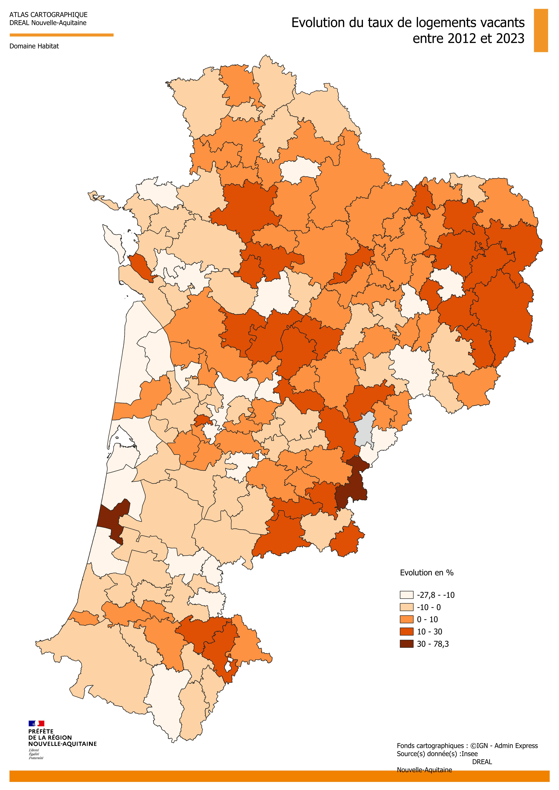{.lightbox style="width:62%;"}
</p>

La carte présentée fait en effet état d’une augmentation de la vacance totale beaucoup plus prononcée à l’Est de la région, dans les secteurs ruraux, des agglomérations comme Poitiers ou Pau.  

A contrario, le littoral présente des taux d’évolution négatifs (soit une diminution de la vacance ou faibles -La Rochelle par exemple-.  

Il y a quelques cas particuliers expliqués précédemment : Bordeaux, dont l’augmentation de la vacance affichée sur la carte est trompeuse et surtout caractérisée par une vacance frictionnelle, ou d’autres territoires dont certaines résidences secondaires, importantes en nombre, ont pu être assimilées à des logements vacants.
:::

## 3. Etat des lieux de la vacance : cartographie
::: {style="font-family: YACkoD1yZN0-0;font-size:1.1em;"}
Selon les données LOVAC, la vacance des logements en Nouvelle-Aquitaine est estimée à 9,5 %, soit environ 340 000 logements. Une partie de ces logements n’est inoccupée que temporairement, notamment entre deux occupants ou à l’occasion de travaux de remise en état. Cette vacance conjoncturelle accompagne la rotation des ménages et l’entretien du parc, contribuant ainsi à la fluidité des parcours résidentiels.  

La présente étude se concentre sur la vacance de longue durée, définie ici comme une inoccupation depuis au moins deux ans et retenue comme indicateur de la vacance structurelle. L’objectif est de repérer les logements durablement inoccupés pour lesquels les acteurs locaux peuvent engager des actions visant à favoriser leur remise sur le marché.  

En Nouvelle-Aquitaine, au 1er janvier 2024, **cette vacance de longue durée concerne environ 154 505 logements, soit 4 % du parc de logements.** Sa répartition départementale, établie à partir des bases de données [LOVAC]{style="cursor:pointer; color: #42429f;" data-bs-toggle="tooltip" title="LOVAC : voir annexe"} pour le parc privé et [RPLS]{style="cursor:pointer; color: #42429f;" data-bs-toggle="tooltip" title="RPLS : Le RPLS (Répertoire des logements locatifs des bailleurs sociaux) est une base statistique actualisée chaque année qui décrit, au 1er janvier, le parc locatif des bailleurs sociaux, notamment les caractéristiques des logements, leurs loyers et leur situation d’occupation ou de vacance.  "} pour le parc social est présentée ci-après. 

```{=html}
<!DOCTYPE html>
<html lang="fr">
<head>
  <meta charset="UTF-8" />
  <meta name="viewport" content="width=device-width, initial-scale=1.0" />
  <title>Évolution Nouvelle-Aquitaine 2020–2024</title>
  <style>
    *, *::before, *::after { box-sizing: border-box; margin: 0; padding: 0; }
    body { font-family: system-ui, sans-serif; background: #f9f9f7; color: #1a1a18; padding: 2rem 1rem; }
    .controls { display: flex; gap: 12px; align-items: center; margin-bottom: 1rem; flex-wrap: wrap; }
    input[type="text"] { flex: 1; min-width: 160px; padding: 8px 12px; border: 0.5px solid #ccc; border-radius: 8px; font-size: 14px; background: #fff; }
    select { padding: 8px 12px; border: 0.5px solid #ccc; border-radius: 8px; font-size: 14px; background: #fff; cursor: pointer; }
    .table-wrap { overflow-x: auto; border: 0.5px solid #e0dfd8; border-radius: 12px; background: #fff; }
    table { width: 100%; border-collapse: collapse; font-size: 14px; table-layout: fixed; }
    thead tr { background: #f1efe8; }
    th { padding: 10px 14px; text-align: left; font-weight: 500; font-size: 13px; color: #5f5e5a; border-bottom: 0.5px solid #e0dfd8; cursor: pointer; user-select: none; white-space: nowrap; }
    th:hover { color: #1a1a18; }
    td { padding: 9px 14px; border-bottom: 0.5px solid #e0dfd8; color: #1a1a18; }
    tr:last-child td { border-bottom: none; }
    tr.total-row td { font-weight: 500; background: #f1efe8; }
    tr:hover:not(.total-row) td { background: #f9f9f7; }
    .badge3 { display: inline-flex; align-items: center; padding: 2px 8px; border-radius: 20px; font-size: 12px; font-weight: 500; }
    .badge3.pos { background: #ddffdd; color: #1a5c1a; }
    .badge3.neg { background: #ffdddd; color: #7a1a1a; }
    .bar-bg { width: 100%; height: 6px; background: #e0dfd8; border-radius: 4px; overflow: hidden; position: relative; }
    .metrics { display: grid; grid-template-columns: repeat(auto-fit, minmax(130px, 1fr)); gap: 10px; margin-bottom: 1rem; }
    .metric { background: #f1efe8; border-radius: 8px; padding: 0.75rem 1rem; }
    .metric-label { font-size: 12px; color: #5f5e5a; margin-bottom: 4px; }
    .metric-value { font-size: 20px; font-weight: 500; }
    .metric-sub { font-size: 11px; color: #888780; margin-top: 2px; }
  </style>
</head>
<body>

<div class="container4">
  <h5 style="text-align:center;">Logements vacants (+2 ans) — Nouvelle-Aquitaine</h5>

  <div class="metrics4" id="metrics4"></div>

  <div class="controls4">
    <input type="text" placeholder="Rechercher un département…" id="search4" oninput="render4()" />
    <select id="sort-col4" onchange="render4()">
      <option value="dep">Département</option>
      <option value="nb">Nb. vacants</option>
      <option value="taux">Taux (%)</option>
      <option value="part">Répartition (%)</option>
    </select>
    <select id="sort-dir4" onchange="render4()">
      <option value="asc">↑ Croissant</option>
      <option value="desc">↓ Décroissant</option>
    </select>
  </div>

  <div class="table-wrap4">
    <table class="table4">
  <thead>
<tr>
  <th onclick="sortBy4('dep')">Département</th>
  <th onclick="sortBy4('nb')" style="text-align:right">Nb. vacants</th>
  <th onclick="sortBy4('taux')" style="text-align:right">Taux</th>
  <th onclick="sortBy4('part')" style="text-align:right">Répartition</th>
  <th style="width:30%">Evolution</th>
</tr>
  </thead>
  <tbody id="tbody4"></tbody>
</table>
  </div>
</div>

<style>
  .container4 { max-width: 900px; margin:20px 0 40px;}
  .controls4 { display: flex; gap: 12px; margin-bottom: 1rem; flex-wrap: wrap; }
  .table-wrap4 { overflow-x: auto; border: 0.5px solid #e0dfd8; border-radius: 12px; background: #fff; }
  .table4 { width: 100%; border-collapse: collapse; font-size: 14px; }
  .table4 th, .table4 td { padding: 9px 14px; border-bottom: 0.5px solid #e0dfd8; }
  .table4 th { background: #f1efe8; cursor: pointer; }
  .table4 tr.total-row4 td { font-weight: 600; background: #f1efe8; }
  .table4 tr:hover:not(.total-row4) td { background: #f9f9f7; }

  .metrics4 { display: grid; grid-template-columns: repeat(auto-fit, minmax(130px, 1fr)); gap: 10px; margin-bottom: 1rem; }
  .metric4 { background: #f1efe8; border-radius: 8px; padding: 0.75rem 1rem; }
  .metric4-label { font-size: 12px; color: #5f5e5a; margin-bottom: 4px; }
  .metric4-value { font-size: 20px; font-weight: 500; }
  .metric4-sub { font-size: 11px; color: #888780; margin-top: 2px; }

  .badge4 { padding: 2px 8px; border-radius: 20px; font-size: 12px; font-weight: 500; }
  .badge4.pos { background:#ddffdd; color:#1a5c1a; }
  .badge4.neg { background:#ffdddd; color:#7a1a1a; }

  .bar-bg4 { width:100%; height:6px; background:#e0dfd8; border-radius:4px; position:relative; overflow:hidden; }
  .bar4 { height:100%; background:#2d8a4e; border-radius:4px; }
</style>

<script>
// --- Données du tableau 4 ---
const raw4 = [
  {dep:"Charente", nb:10956, taux:5.20, part:7.09},
  {dep:"Charente-Maritime", nb:14491, taux:3.00, part:9.38},
  {dep:"Corrèze", nb:11373, taux:6.90, part:7.36},
  {dep:"Creuse", nb:9401, taux:10.00, part:6.08},
  {dep:"Dordogne", nb:15702, taux:5.60, part:10.16},
  {dep:"Gironde", nb:24268, taux:2.50, part:15.71},
  {dep:"Landes", nb:9574, taux:3.30, part:6.20},
  {dep:"Lot-et-Garonne", nb:12535, taux:6.40, part:8.11},
  {dep:"Pyrénées-Atlantiques", nb:13701, taux:3.90, part:8.86},
  {dep:"Deux-Sèvres", nb:7894, taux:3.80, part:5.11},
  {dep:"Vienne", nb:11430, taux:4.50, part:7.40},
  {dep:"Haute-Vienne", nb:13180, taux:5.60, part:8.53},
];

const total4 = { dep:"Nouvelle-Aquitaine", nb:154505, taux:4.00, part:100.00 };

let currentSort4 = "dep";
let currentDir4 = "asc";

function sortBy4(col) {
  if (currentSort4 === col) currentDir4 = currentDir4 === "asc" ? "desc" : "asc";
  else { currentSort4 = col; currentDir4 = "asc"; }
  document.getElementById("sort-col4").value = col;
  document.getElementById("sort-dir4").value = currentDir4;
  render4();
}

function render4() {
  const q   = document.getElementById("search4").value.toLowerCase();
  const col = document.getElementById("sort-col4").value;
  const dir = document.getElementById("sort-dir4").value;

  let rows = raw4.filter(r => r.dep.toLowerCase().includes(q));

  rows.sort((a,b) => {
    if (col === "dep") return dir === "asc"
      ? a.dep.localeCompare(b.dep, "fr")
      : b.dep.localeCompare(a.dep, "fr");
    return dir === "asc" ? a[col] - b[col] : b[col] - a[col];
  });

  const maxPart = Math.max(...rows.map(r => r.part));

  const tbody = document.getElementById("tbody4");
  tbody.innerHTML = rows.map(r => `
    <tr>
      <td>${r.dep}</td>
      <td style="text-align:right">${r.nb.toLocaleString("fr-FR")}</td>
      <td style="text-align:right">${r.taux.toFixed(2)}%</td>
      <td style="text-align:right">
        <span class="badge4 pos">${r.part.toFixed(2)}%</span>
      </td>
      <td>
        <div class="bar-bg4">
          <div class="bar4" style="width:${(r.part/maxPart)*100}%"></div>
        </div>
      </td>
    </tr>
  `).join("");

  // TOTAL
  tbody.innerHTML += `
    <tr class="total-row4">
      <td>${total4.dep}</td>
      <td style="text-align:right">${total4.nb.toLocaleString("fr-FR")}</td>
      <td style="text-align:right">${total4.taux.toFixed(2)}%</td>
      <td style="text-align:right"><span class="badge4 pos">100.00%</span></td>
      <td></td>
    </tr>
  `;

  renderMetrics4(rows);
}

function renderMetrics4(rows) {
  const maxVac = [...rows].sort((a,b)=>b.nb-a.nb)[0];
  const maxTaux = [...rows].sort((a,b)=>b.taux-a.taux)[0];
  const maxPart = [...rows].sort((a,b)=>b.part-a.part)[0];

  document.getElementById("metrics4").innerHTML = `
    <div class="metric4">
      <div class="metric4-label">Total logements vacants</div>
      <div class="metric4-value">${total4.nb.toLocaleString("fr-FR")}</div>
      <div class="metric4-sub">${total4.dep}</div>
    </div>

    <div class="metric4">
      <div class="metric4-label">Plus grand nombre</div>
      <div class="metric4-value">${maxVac.nb.toLocaleString("fr-FR")}</div>
      <div class="metric4-sub">${maxVac.dep}</div>
    </div>

    <div class="metric4">
      <div class="metric4-label">Taux le plus élevé</div>
      <div class="metric4-value">${maxTaux.taux.toFixed(2)}%</div>
      <div class="metric4-sub">${maxTaux.dep}</div>
    </div>

    <div class="metric4">
      <div class="metric4-label">Plus forte répartition</div>
      <div class="metric4-value">${maxPart.part.toFixed(2)}%</div>
      <div class="metric4-sub">${maxPart.dep}</div>
    </div>
  `;
}

render4();
</script>
```

<p style="text-align: center !important;">
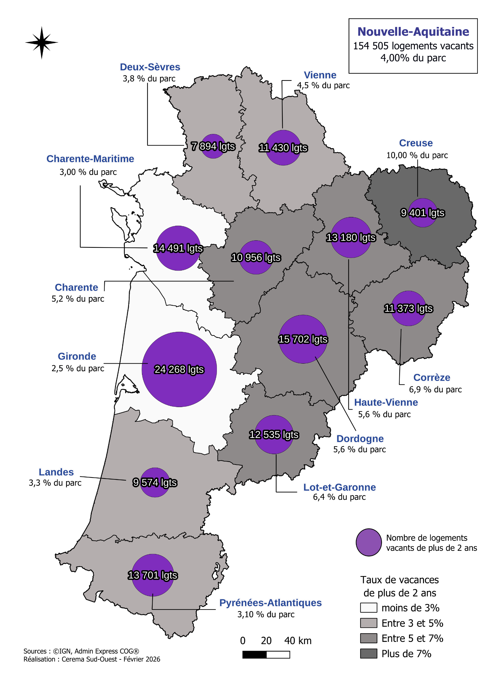{.lightbox style="width:62%;"}
</p>

Cette ne mesure pas l’évolution de la vacance **mais confirme clairement la tendance à une vacance installée qui plus importante dans les départements de l’Est (+ de 5 % de logements vacants -longue durée-), et a contrario plus faible sur le littoral. La carte suivante de la vacance par EPCI confirme cette une vacance plus importante sur les EPCI de l’Est de la région.**
:::

### 3.1 La vacance par EPCI
::: {style="font-family: YACkoD1yZN0-0;font-size:1.1em;"}
<p style="text-align: center !important;">
{.lightbox style="width:62%;"}
</p>

<div style="border: 1px solid; padding:5px;">
La carte met en évidence un **contraste ouest–est marqué** de la vacance de plus de deux ans. Les taux sont généralement plus faibles sur le littoral et dans les intercommunalités des principaux pôles urbains, où ils se situent souvent entre **1 et 4 %.**  

À l’inverse, les niveaux les plus élevés, compris entre **9 et 14 %**, se concentrent surtout dans le nord-est et l’est de la région, notamment dans la Creuse et l’est de la Corrèze. De nombreux territoires intérieurs présentent également des taux élevés, entre **6 et 9 %.**  

Cette répartition reste toutefois contrastée : les intercommunalités de Limoges, de Périgueux ou d’Angoulême affichent des taux plus faibles que plusieurs des territoires qui les entourent.
</div>
:::

### 3.2 La vacance par commune
::: {style="font-family: YACkoD1yZN0-0;font-size:1.1em;"}
<p style="text-align: center !important;">
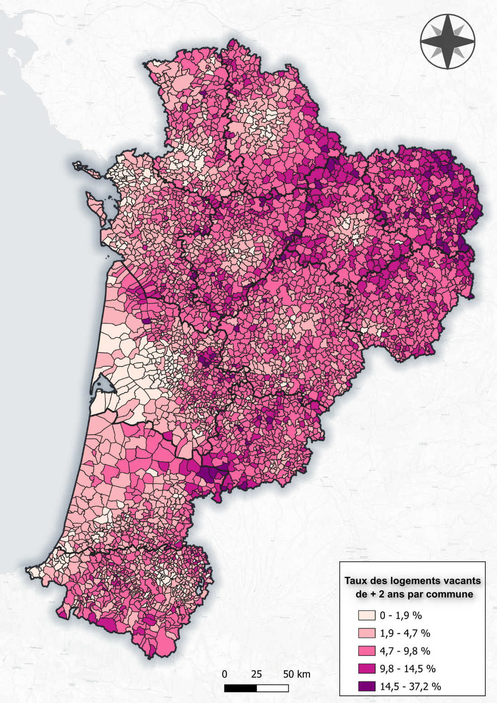{.lightbox style="width:62%;"}
</p>

<div style="border:1px solid; padding:5px;">
À l’échelle communale, la carte confirme des **taux de vacance de plus de deux ans généralement plus faibles sur le littoral et autour des principaux pôles urbains**, souvent inférieurs à **4,7 %**. Les taux supérieurs à **9,8 %** se concentrent davantage dans le nord-est et certains territoires intérieurs, mais des poches de vacance élevée apparaissent également dans le centre et le sud de la région.
</div>

Certaines communes relèvent ainsi de la classe la plus élevée, comprise entre **14,5 et 37,2 %.** Cette représentation révèle surtout une **forte hétérogénéité entre communes voisines**, que les moyennes intercommunales atténuent, et souligne l’intérêt d’une analyse locale pour préciser les secteurs les plus concernés.  

**Les données ayant permis de réaliser cette carte, disponible dans la matrice**, mettent en évidence plusieurs situations de vacance particulièrement marquées. Certaines villes moyennes cumulent des taux élevés et des volumes importants de logements durablement vacants, comme Aubusson ou Tulle.  

Dans plusieurs de ces territoires, une part importante de cette vacance est ancienne, avec des taux de vacance de plus de cinq ans atteignant des taux important.

Quelques petites communes affichent des niveaux extrêmement élevés — par exemple Bousses : 37,2 %, Saint-Antoine-du-Queyret : 29,2 %, Saint-Georges : 27,9 % ou Saint-Pierre-le-Bost : 26 % — mais ces taux portent parfois sur seulement quelques dizaines de logements. Ils signalent néanmoins une vacance très profondément installée, particulièrement lorsque le taux à plus de cinq ans reste lui aussi élevé : 34,9 % à Bousses, 25,6 % à Saint-Georges, 21,1 % à Saint-Pierre-le-Bost.  

À l’inverse, les principaux pôles urbains peuvent présenter des stocks importants en valeur absolue, mais des taux nettement plus faibles. Cette distinction entre volume et taux est essentielle pour identifier les territoires où la vacance constitue un phénomène réellement structurel.
Bordeaux compte **4 740 logements vacants depuis plus de deux ans**, mais ceux-ci ne représentent que **2,6 % du parc** ; Limoges en compte **3 206**, soit **3,7 %** ; Pau **1 768**, soit **3,2 %** ; Poitiers **1 502**, soit **2,6 %.** Cela montre que le nombre brut de logements vacants ne suffit pas à qualifier la gravité d’une situation.

→ **Une cartographie de 70 communes (métropole, agglomérations et petites villes) est disponible dans <a href="iris.html">cet onglet</a>**. Elle présente la vacance par quartier IRIS et les variations au sein d’une même commune (nombre et % de logements vacants).

```{=html}
<div style="border:1px solid; padding:10px; display:flex; gap:20px; align-items:flex-start;" class="vacance_maison">
  <div style="flex:1;">
    <p><strong>Des situations particulièrement marquées :</strong></p>
    <p>
      L'analyse communale fait apparaître plusieurs situations de vacance structurelle conséquente.
      En ne retenant que les communes comptant au moins 100 logements vacants depuis plus de deux ans,
      une vingtaine de territoires présentent des taux supérieurs à 10 %. Certaines communes cumulent
      un taux élevé et un stock conséquent, notamment Aubusson (494 logements ; 15,6 %),
      Bort-les-Orgues (362 ; 16,2 %), Tulle (1 139 ; 11,1 %) ou Fumel (319 ; 10,4 %).
      La durée de vacance constitue un indicateur supplémentaire de fragilité : dans plusieurs communes,
      plus de 60 % des logements vacants depuis deux ans le sont déjà depuis plus de cinq ans.
      Ces situations traduisent une vacance profondément installée, qui dépasse largement les phénomènes
      de rotation du marché.
    </p>
    <p>Voir tableau suivant, extrait de la matrice réalisée par le CEREMA.</p>
  </div>
  <div style="flex:0 0 250px;">
    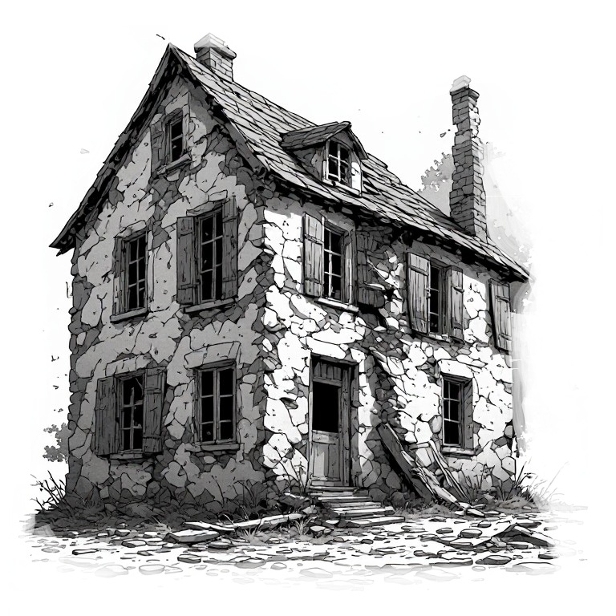
  </div>
</div>

<style>
@media (max-width:1100px){
  .vacance_maison{
  display:block !important;
  }
}
</style>
<br>
```

<div style="text-align: center !important;">
**communes présentant les situations de vacance longue les plus marquées**  
Sélection : au moins 100 logements vacants depuis plus de 2 ans – LOVAC 2024
</div>

```{=html}
<style>
  table.vacance-table {
    width: 100%;
    border-collapse: collapse;
    font-size: 15px;
  }

  /* Ligne d’en‑tête gris foncé */
  table.vacance-table thead tr {
    background: #444;
    color: white;
  }

  table.vacance-table th,
  table.vacance-table td {
    padding: 8px 12px;
    border: 1px solid #ddd;
    text-align: center;
  }
  
  /* Autoriser le retour à la ligne dans les en-têtes */
  table.vacance-table th {
    white-space: normal;
    word-break: break-word;
    vertical-align:middle;
  }
  
  /* Option : élargir légèrement la colonne problématique */
  table.vacance-table th:nth-child(6) {
    min-width: 160px;
  }


  /* Alternance gris clair / blanc */
  table.vacance-table tbody tr:nth-child(odd) {
    background: #f7f7f7;   /* gris très clair */
  }

  table.vacance-table tbody tr:nth-child(even) {
    background: #ffffff;   /* blanc */
  }
</style>

<table class="vacance-table">
  <thead>
    <tr>
      <th>Commune</th>
      <th>Vacants +2 ans</th>
      <th>Taux +2 ans</th>
      <th>Vacants +5 ans</th>
      <th>Taux +5 ans</th>
      <th>Part des +5 ans parmi les +2 ans</th>
    </tr>
  </thead>

  <tbody>
    <tr><td>Saint-Émilion</td><td>218</td><td>17,1 %</td><td>149</td><td>11,7 %</td><td>68 %</td></tr>
    <tr><td>Bort-les-Orgues</td><td>362</td><td>16,2 %</td><td>173</td><td>7,7 %</td><td>48 %</td></tr>
    <tr><td>Aubusson</td><td>494</td><td>15,6 %</td><td>278</td><td>8,8 %</td><td>56 %</td></tr>
    <tr><td>Auzances</td><td>125</td><td>14,0 %</td><td>80</td><td>9,0 %</td><td>64 %</td></tr>
    <tr><td>Bourganeuf</td><td>237</td><td>13,5 %</td><td>161</td><td>9,1 %</td><td>68 %</td></tr>
    <tr><td>Eymoutiers</td><td>202</td><td>12,6 %</td><td>141</td><td>8,8 %</td><td>70 %</td></tr>
    <tr><td>Montagne</td><td>116</td><td>12,4 %</td><td>79</td><td>8,4 %</td><td>68 %</td></tr>
    <tr><td>Châlus</td><td>155</td><td>12,2 %</td><td>114</td><td>9,0 %</td><td>74 %</td></tr>
    <tr><td>Boussac</td><td>117</td><td>12,0 %</td><td>78</td><td>8,0 %</td><td>67 %</td></tr>
    <tr><td>Lathus-Saint-Rémy</td><td>117</td><td>12,0 %</td><td>76</td><td>7,8 %</td><td>65 %</td></tr>
    <tr><td>Sainte-Foy-la-Grande</td><td>226</td><td>11,9 %</td><td>116</td><td>6,1 %</td><td>51 %</td></tr>
    <tr><td>Saint-Laurent-sur-Gorre</td><td>113</td><td>11,9 %</td><td>52</td><td>5,5 %</td><td>46 %</td></tr>
    <tr><td>Bussière-Poitevine</td><td>198</td><td>11,8 %</td><td>127</td><td>7,6 %</td><td>64 %</td></tr>
    <tr><td>Mézin</td><td>118</td><td>11,8 %</td><td>63</td><td>6,3 %</td><td>53 %</td></tr>
    <tr><td>Uzerche</td><td>210</td><td>11,6 %</td><td>132</td><td>7,3 %</td><td>63 %</td></tr>
    <tr><td>Chalais</td><td>147</td><td>11,6 %</td><td>93</td><td>7,4 %</td><td>63 %</td></tr>
    <tr><td>Corrèze</td><td>102</td><td>11,3 %</td><td>65</td><td>7,2 %</td><td>64 %</td></tr>
    <tr><td>Tulle</td><td>1 139</td><td>11,1 %</td><td>691</td><td>6,7 %</td><td>61 %</td></tr>
    <tr><td>Le Dorat</td><td>132</td><td>11,1 %</td><td>70</td><td>5,9 %</td><td>53 %</td></tr>
    <tr><td>Lubersac</td><td>166</td><td>10,6 %</td><td>105</td><td>6,7 %</td><td>63 %</td></tr>
    <tr><td>Fumel</td><td>319</td><td>10,4 %</td><td>184</td><td>6,0 %</td><td>58 %</td></tr>
  </tbody>
</table>

<div style="font-size:0.8em; color:gray;">
Lecture : la dernière colonne mesure la proportion des logements vacants depuis plus de 5 ans parmi ceux vacants depuis plus de 2 ans.
</div>
```
:::

## 4. Les caractéristiques des logements vacants (longue durée) du parc privé.
::: {style="font-family: YACkoD1yZN0-0;font-size:1.1em;"}
La vacance concerne quasiment uniquement le parc privé (locatif ou non) : dans tous les  EPCI, 97 % au moins des logements vacants de plus de deux ans sont des logements privés. La matrice fournie (document à part disponible avec l’étude) fournit les caractéristiques du parc privé et social vacant.  

Voir chapitre in fine sur la vacance dans le parc social.
:::

### 4.1 Les logements vacants majoritairement anciens
::: {style="font-family: YACkoD1yZN0-0;font-size:1.1em;"}
Le parc privé vacant depuis plus de deux ans se caractérise par une **forte surreprésentation des logements anciens.** Ainsi, **68 % des logements durablement vacants ont été construits avant 1949**, alors que cette période de construction ne représente que **33 % de l’ensemble du parc de logements régional.**  

À contrario, les logements plus récents sont nettement moins représentés parmi les logements vacants de longue durée. Les logements construits **à partir de 1980 représentent 44 % du parc régional**, mais seulement **16 % des logements vacants depuis plus de deux ans.**  

Ces résultats mettent ainsi en évidence **un lien marqué entre ancienneté du bâti et vacance de longue durée.** Ils peuvent notamment traduire une moindre adéquation d’une partie du parc ancien aux attentes actuelles ou des besoins plus importants en matière de rénovation et de remise aux normes. La période de construction ne permet toutefois pas, à elle seule, d’identifier les causes de la vacance.

::: center
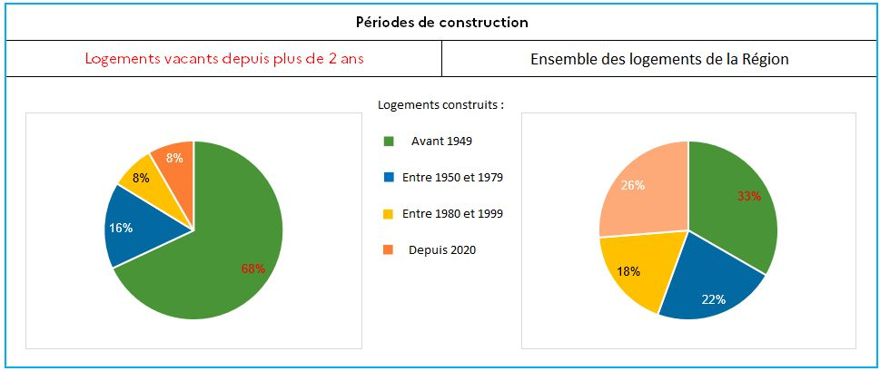{.lightbox}
:::

:::

### 4.2 Une majorité de maisons parmi les logements vacants qui cache des disparités entre les territoires
::: {style="font-family: YACkoD1yZN0-0;font-size:1.1em;"}

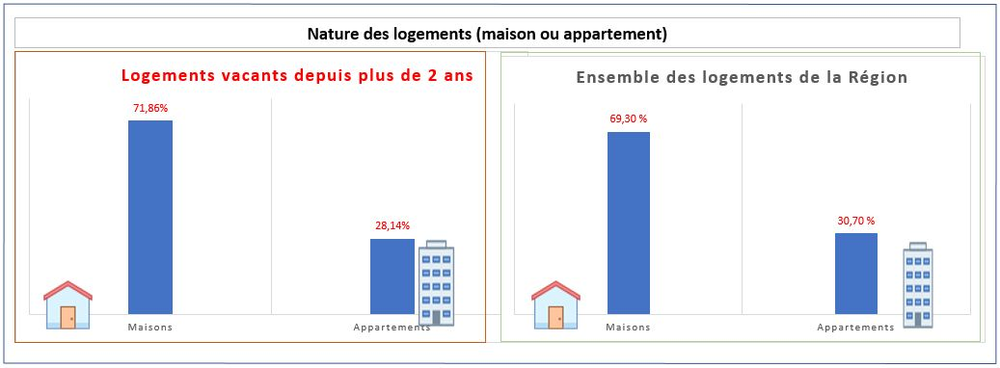{.lightbox}

À l’échelle régionale, la répartition des logements privés vacants depuis plus de deux ans est relativement proche de celle de l’ensemble du parc : **71,9 % des logements durablement vacants sont des maisons, contre 69,3 % dans le parc régional.** Les maisons ne sont donc que légèrement surreprésentées dans la vacance longue.  

**Cette moyenne régionale masque toutefois des situations locales très contrastées.** Dans de nombreuses villes et communes-centres, la vacance de longue durée concerne majoritairement des appartements, tandis que dans les territoires ruraux, où le parc est essentiellement composé de maisons individuelles, celles-ci prédominent logiquement parmi les logements vacants.  

À titre d’exemple, les appartements représentent la majorité des logements privés vacants de plus de deux ans à La Rochelle, Rochefort, Brive-la-Gaillarde, Aubusson ou encore Pau. Limoges compte 5 fois plus d’appartements vacants (longue durée) que de maison, Poitiers compte trois fois plus d’appartements vacants...  

**La nature du logement ne semble donc pas constituer, à elle seule, un facteur explicatif de la vacance longue : son analyse doit être mise en regard de la structure locale du parc et du type de territoire.**
:::


### 4.3 Une sur-représentation des petits logements
::: {style="font-family: YACkoD1yZN0-0;font-size:1.1em;"}
Les **[petits logements (T1-T2)]{style="cursor:pointer; color: #42429f;" data-bs-toggle="tooltip" title="Dans cette étude, la typologie des logements correspond au nombre de pièces principales : T1 pour une pièce principale, T2 pour deux, etc. Les cuisines, salles de bains et autres pièces de service ne sont pas comptabilisées."}** sont nettement surreprésentés parmi les logements vacants depuis plus de deux ans. Ils représentent **40 % de la vacance longue**, alors qu’ils ne constituent que **22 % de l’ensemble du parc régional.**  

À l’inverse, **les grands logements (T5 et plus)** sont sous-représentés parmi les logements durablement vacants : ils représentent **16 % des logements vacants depuis plus de deux ans**, contre **26 % du parc régional.** Les logements de taille intermédiaire **(T3-T4)** présentent une répartition plus proche de celle observée dans l’ensemble du parc, avec **44 % des logements vacants**, contre **53 % du parc régional.**  

Ces résultats suggèrent ainsi que **la vacance de longue durée touche proportionnellement davantage les petits logements,** tandis que les grands logements apparaissent moins concernés.

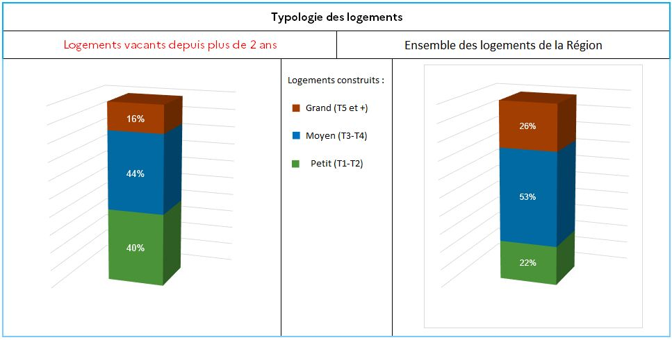{.lightbox}
:::

### 4.4 Qualité du bâti : un parc vacant présentant des niveaux de qualité supposée contrastés
::: {style="font-family: YACkoD1yZN0-0;font-size:1.1em;"}
Le **[classement cadastral]{style="cursor:pointer; color: #42429f;" data-bs-toggle="tooltip" title="Le classement cadastral est un indicateur de la qualité générale du logement établi notamment à partir du caractère architectural du bâtiment, de la qualité de la construction et de ses équipements. Utilisé pour déterminer la valeur locative cadastrale, il distingue huit catégories, de la catégorie 1, correspondant aux logements présentant les caractéristiques les plus favorables, à la catégorie 8, correspondant aux logements les plus dégradés. Il s’agit toutefois d’un classement fiscal, qui ne constitue pas un diagnostic actualisé de l’état du logement."}** permet d’apporter une première indication sur la qualité générale des logements vacants. Les catégories les moins favorables, notamment les catégories **7 et 8**, correspondent aux logements présentant les caractéristiques de bâti les plus dégradées. La catégorie **6**, plus hétérogène, correspond à un niveau de qualité plus modeste et ne peut être assimilée systématiquement à un logement dégradé.  

```{=html}
<style>
.table-wrapper {
  overflow-x: auto;
  -webkit-overflow-scrolling: touch;
}

.cadastral-table {
  width: 100%;
  border-collapse: collapse;
}

.cadastral-table th,
.cadastral-table td {
  border: 1px solid #ccc;
  padding: 8px;
  vertical-align: top;
  white-space: normal;
  word-break: break-word;
  font-size: 14px;
}

/* En-tête gris foncé (optionnel) */
.cadastral-table thead th {
  background: #444;
  color: white;
}
</style>

<div class="table-wrapper">
<table class="cadastral-table" style="border-collapse:collapse; width:100%;">
  <thead>
    <tr>
      <th style="border:1px solid #ccc;">Catégorie</th>
      <th style="border:1px solid #ccc;">1re catégorie</th>
      <th style="border:1px solid #ccc;">2e catégorie</th>
      <th style="border:1px solid #ccc;">3e catégorie</th>
      <th style="border:1px solid #ccc;">4e catégorie</th>
      <th style="border:1px solid #ccc;">5e catégorie</th>
      <th style="border:1px solid #ccc;">6e catégorie</th>
      <th style="border:1px solid #ccc;">7e catégorie</th>
      <th style="border:1px solid #ccc;">8e catégorie</th>
    </tr>
  </thead>

  <tbody>

    <!-- Ligne : Caractère architectural -->
    <tr>
      <td style="border:1px solid #ccc;"><strong>Caractère architectural</strong></td>
      <td style="border:1px solid #ccc;">Nettement somptueux</td>
      <td style="border:1px solid #ccc;">Particulièrement soigné</td>

      <!-- Belle apparence sur 3e + 4e -->
      <td colspan="2" style="border:1px solid #ccc; text-align:center;">
        Belle apparence
      </td>

      <!-- Sans caractère particulier sur 5e + 6e + 7e -->
      <td colspan="3" style="border:1px solid #ccc; text-align:center;">
        Sans caractère particulier
      </td>

      <td style="border:1px solid #ccc;">Aspect délabré</td>
    </tr>

    <!-- Ligne : Qualité de la construction -->
    <tr>
      <td style="border:1px solid #ccc;"><strong>Qualité de la construction</strong></td>

      <!-- Excellente sur 1re + 2e -->
      <td colspan="2" style="border:1px solid #ccc;">
        Excellente. Matériaux de tout premier ordre ou d’excellente qualité. Parfaite habitabilité.
      </td>

      <td style="border:1px solid #ccc;">
        Très bonne. Matériaux assurant une très bonne habitabilité.
      </td>

      <!-- Bonne sur 4e + 5e -->
      <td colspan="2" style="border:1px solid #ccc;">
        Bonne. Mais construction d’une classe et d’une qualité inférieures aux précédentes catégories.
      </td>
      
      <td style="border:1px solid #ccc;">
        Courante. Matériaux utilisés habituellement dans la région, assurant des conditions d’habitabilité normales mais une durée d’existence limitée pour les immeubles récents.
      </td>

      <td style="border:1px solid #ccc;">
        Médiocre. Construction économique en matériaux bon marché présentant souvent certains vices.
      </td>

      <td style="border:1px solid #ccc;">
        Particulièrement défectueuse. Ne présente pas ou ne présente plus les caractères élémentaires d’habitabilité en raison de la nature des matériaux utilisés, de la vétusté, etc.
      </td>

    </tr>

  </tbody>
</table>
</div>
```

Le classement cadastral entre notamment dans les critères utilisés pour le repérage du **parc privé potentiellement indigne (PPPI)**, mais il ne permet pas, à lui seul, de déterminer l’état réel d'un logement ni l'ampleur des travaux nécessaires à sa remise en occupation.  

```{=html}
<div class="container5" style="margin:20px 0 40px;">
  <h5 style="text-align:center;">Classement cadastral des logements vacants</h5>

  <div class="controls5">
    <input type="text" placeholder="Rechercher un département…" id="search5" oninput="render5()" />
    <select id="sort-col5" onchange="render5()">
      <option value="dep">Département</option>
      <option value="c3_nb">Classe 3 Nb</option>
      <option value="c3_pct">Classe 3 %</option>
      <option value="c4_nb">Classe 4 Nb</option>
      <option value="c4_pct">Classe 4 %</option>
      <option value="c5_nb">Classe 5 Nb</option>
      <option value="c5_pct">Classe 5 %</option>
      <option value="c6_nb">Classe 6 Nb</option>
      <option value="c6_pct">Classe 6 %</option>
      <option value="c7_nb">Classe 7 Nb</option>
      <option value="c7_pct">Classe 7 %</option>
      <option value="c8_nb">Classe 8 Nb</option>
      <option value="c8_pct">Classe 8 %</option>
    </select>
    <select id="sort-dir5" onchange="render5()">
      <option value="asc">↑ Croissant</option>
      <option value="desc">↓ Décroissant</option>
    </select>
  </div>

  <div class="table-wrap5">
    <table class="table5">
  <thead>
<tr>
  <th rowspan="2" onclick="sortBy5('dep')">Département</th>
  <th colspan="2" style="text-align:center;">3</th>
  <th colspan="2" style="text-align:center;">4</th>
  <th colspan="2" style="text-align:center;">5</th>
  <th colspan="2" style="text-align:center;">6</th>
  <th colspan="2" style="text-align:center;">7</th>
  <th colspan="2" style="text-align:center;">8</th>
</tr>
<tr>
  <th style="text-align: end;">Nb</th><th style="text-align: end;">%</th>
  <th style="text-align: end;">Nb</th><th style="text-align: end;">%</th>
  <th style="text-align: end;">Nb</th><th style="text-align: end;">%</th>
  <th style="text-align: end;">Nb</th><th style="text-align: end;">%</th>
  <th style="text-align: end;">Nb</th><th style="text-align: end;">%</th>
  <th style="text-align: end;">Nb</th><th style="text-align: end;">%</th>
</tr>
  </thead>
  <tbody id="tbody5"></tbody>
</table>
  </div>
</div>

<style>
  .container5 { max-width: 1100px; margin: 0 auto; }
  .controls5 { display: flex; gap: 12px; margin-bottom: 1rem; flex-wrap: wrap; }
  .table5 {
  width: 100%;
  border-collapse: collapse;
  font-size: 13px;
  table-layout: fixed; /* important */
}

  .table5 th, .table5 td {
    padding: 6px 8px;
    border-bottom: 0.5px solid #e0dfd8;
    text-align: right;
    width: 70px; /* largeur uniforme */
  }
  
  .table5 th:first-child,
  .table5 td:first-child {
    text-align: left;
    width: 160px; /* colonne Département */
  }
  
  .table5 thead tr:first-child th { background:#f1efe8; }
  .table5 thead tr:nth-child(2) th { background:#f7f5ee; text-align: end; }
  .table5 tr:hover:not(.total-row5) td { background:#f9f9f7; }
  .table5 .total-row5 td { font-weight:600; background:#f1efe8; }
  .table5 tbody tr:nth-child(odd):not(.total-row5) {
  background: #faf9f5;
}

  .table5 tbody tr:nth-child(even):not(.total-row5) {
    background: #a49b79;
  }
  
  .table5 tr:hover:not(.total-row5) td {
    background:#f9f9f7;
  }


</style>

<script>
const raw5 = [
  {dep:"Charente", c3_nb:31, c3_pct:0.3, c4_nb:371, c4_pct:3.4, c5_nb:2494, c5_pct:22.8, c6_nb:4873, c6_pct:44.6, c7_nb:2239, c7_pct:20.5, c8_nb:931, c8_pct:8.5},
  {dep:"Charente-Maritime", c3_nb:35, c3_pct:0.2, c4_nb:584, c4_pct:4.1, c5_nb:3586, c5_pct:24.9, c6_nb:7483, c6_pct:51.9, c7_nb:2325, c7_pct:16.1, c8_nb:467, c8_pct:3.2},
  {dep:"Corrèze", c3_nb:28, c3_pct:0.2, c4_nb:412, c4_pct:3.6, c5_nb:2680, c5_pct:23.6, c6_nb:5200, c6_pct:45.7, c7_nb:2300, c7_pct:20.2, c8_nb:753, c8_pct:6.6},
  {dep:"Creuse", c3_nb:22, c3_pct:0.2, c4_nb:350, c4_pct:3.7, c5_nb:2100, c5_pct:22.3, c6_nb:4300, c6_pct:45.7, c7_nb:1900, c7_pct:20.2, c8_nb:729, c8_pct:7.7},
  {dep:"Dordogne", c3_nb:40, c3_pct:0.3, c4_nb:600, c4_pct:3.8, c5_nb:3000, c5_pct:19.1, c6_nb:7800, c6_pct:49.7, c7_nb:3100, c7_pct:19.7, c8_nb:1162, c8_pct:7.4},
  {dep:"Gironde", c3_nb:50, c3_pct:0.2, c4_nb:700, c4_pct:2.9, c5_nb:3500, c5_pct:14.4, c6_nb:12000, c6_pct:49.4, c7_nb:5500, c7_pct:22.7, c8_nb:1518, c8_pct:6.3},
  {dep:"Landes", c3_nb:20, c3_pct:0.2, c4_nb:300, c4_pct:3.1, c5_nb:2000, c5_pct:20.9, c6_nb:4500, c6_pct:47.0, c7_nb:1800, c7_pct:18.8, c8_nb:954, c8_pct:10.0},
  {dep:"Lot-et-Garonne", c3_nb:25, c3_pct:0.2, c4_nb:350, c4_pct:2.8, c5_nb:2500, c5_pct:19.9, c6_nb:6000, c6_pct:47.9, c7_nb:2500, c7_pct:19.9, c8_nb:1160, c8_pct:9.3},
  {dep:"Pyrénées-Atlantiques", c3_nb:30, c3_pct:0.2, c4_nb:450, c4_pct:3.3, c5_nb:3000, c5_pct:22.0, c6_nb:7000, c6_pct:51.1, c7_nb:2500, c7_pct:18.2, c8_nb:721, c8_pct:5.2},
  {dep:"Deux-Sèvres", c3_nb:18, c3_pct:0.2, c4_nb:280, c4_pct:3.5, c5_nb:1800, c5_pct:22.8, c6_nb:3800, c6_pct:48.1, c7_nb:1500, c7_pct:19.0, c8_nb:496, c8_pct:6.3},
  {dep:"Vienne", c3_nb:22, c3_pct:0.2, c4_nb:320, c4_pct:3.0, c5_nb:2100, c5_pct:19.0, c6_nb:5000, c6_pct:45.0, c7_nb:2300, c7_pct:20.7, c8_nb:788, c8_pct:7.1},
  {dep:"Haute-Vienne", c3_nb:30, c3_pct:0.2, c4_nb:400, c4_pct:3.0, c5_nb:2400, c5_pct:18.2, c6_nb:6000, c6_pct:45.5, c7_nb:2600, c7_pct:19.7, c8_nb:1150, c8_pct:8.7}
];

let currentSort5 = "dep";
let currentDir5  = "asc";

function sortBy5(col) {
  if (currentSort5 === col) currentDir5 = currentDir5 === "asc" ? "desc" : "asc";
  else { currentSort5 = col; currentDir5 = "asc"; }
  document.getElementById("sort-col5").value = col;
  document.getElementById("sort-dir5").value = currentDir5;
  render5();
}

function render5() {
  const q   = document.getElementById("search5").value.toLowerCase();
  const col = document.getElementById("sort-col5").value;
  const dir = document.getElementById("sort-dir5").value;

  let rows = raw5.filter(r => r.dep.toLowerCase().includes(q));

  rows.sort((a,b) => {
    if (col === "dep") return dir === "asc"
      ? a.dep.localeCompare(b.dep,"fr")
      : b.dep.localeCompare(a.dep,"fr");
    return dir === "asc" ? a[col] - b[col] : b[col] - a[col];
  });

  const tbody = document.getElementById("tbody5");
  tbody.innerHTML = rows.map(r => `
    <tr>
      <td>${r.dep}</td>
      <td>${r.c3_nb}</td><td>${r.c3_pct}%</td>
      <td>${r.c4_nb}</td><td>${r.c4_pct}%</td>
      <td>${r.c5_nb}</td><td>${r.c5_pct}%</td>
      <td>${r.c6_nb}</td><td>${r.c6_pct}%</td>
      <td>${r.c7_nb}</td><td>${r.c7_pct}%</td>
      <td>${r.c8_nb}</td><td>${r.c8_pct}%</td>
    </tr>
  `).join("");

  <!-- // TOTAL -->
  <!-- tbody.innerHTML += ` -->
  <!--   <tr class="total-row5"> -->
  <!--     <td>Total</td> -->
  <!--     <td colspan="12"></td> -->
  <!--   </tr> -->
  <!-- `; -->
}

render5();
</script>
```

À l’échelle régionale, **28,3 % des logements privés vacants depuis plus de deux ans relèvent des catégories cadastrales 3, 4 ou 5**, correspondant aux niveaux de qualité les plus favorables parmi le parc étudié. En intégrant la catégorie 6, cette proportion devient nettement majoritaire. Elle dépasse notamment **80 % dans les Pyrénées-Atlantiques, en Gironde, dans les Landes et en Charente-Maritime.**  

Ces résultats suggèrent qu’**une part importante du parc vacant de longue durée ne relève pas des catégories cadastrales les plus dégradées.** Une partie de ces logements pourrait ainsi présenter un potentiel de remise en occupation avec des interventions limitées ou modérées. **Cette hypothèse doit toutefois être confirmée par une analyse plus fine de l’état réel des logements**, le classement cadastral ne permettant pas d’évaluer précisément la nature ni le coût des travaux nécessaires. Enfin, ce classement cadastral est parfois obsolète, les logements concernés n’ayant plus rien à avoir avec leur catégorie.

<div style="border: 1px solid; padding:5px;">
<p style="text-align:center !important; font-weight:bold;">Lecture territoriale :  </p>  
<p>
La répartition territoriale fait apparaître des différences sensibles dans la qualité cadastrale du parc vacant. Certains départements présentent une part relativement importante de logements relevant des catégories les plus favorables, tandis que d’autres concentrent davantage de logements classés dans les catégories inférieures.

Les Deux-Sèvres et les Pyrénées-Atlantiques se distinguent notamment par une proportion importante de logements vacants relevant des catégories cadastrales 3 à 5.
La Vienne et la Creuse présentent une part plus importante de logements classés dans les catégories les moins favorables, ce qui peut traduire un potentiel de réhabilitation plus important. Il convient néanmoins de rester prudent : ces données constituent un indicateur de présomption et non une mesure directe de l’état du bâti ou du coût de sa remise sur le marché.
</p>
<p style="display:flex; width:100%; justify-content:center; align-items:center;">
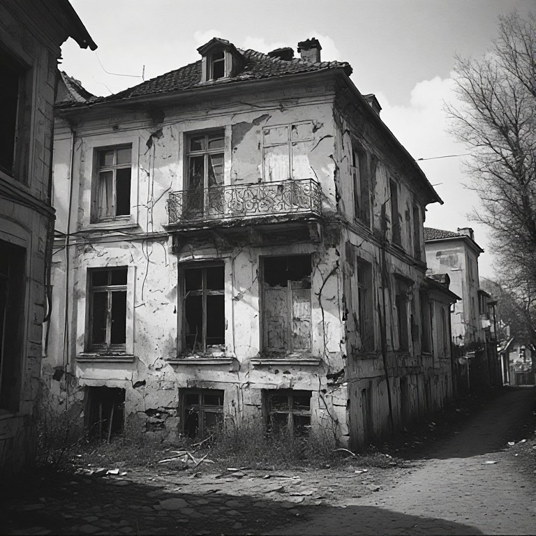
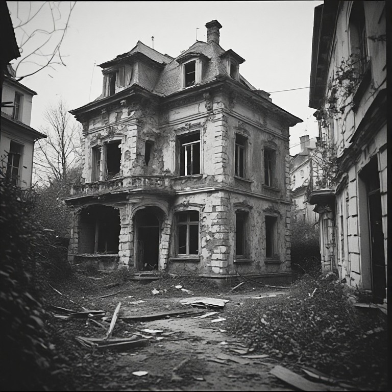
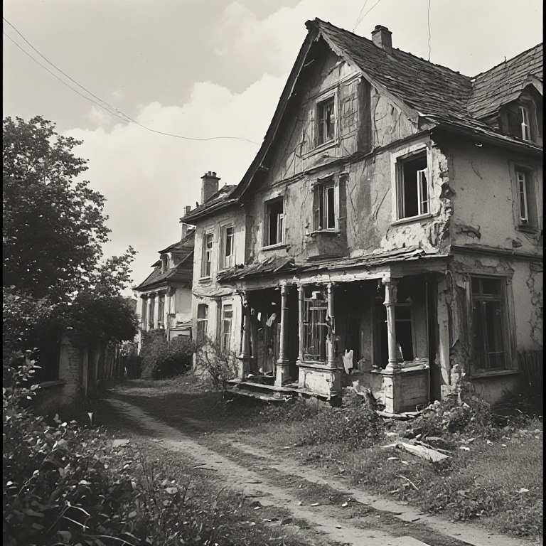
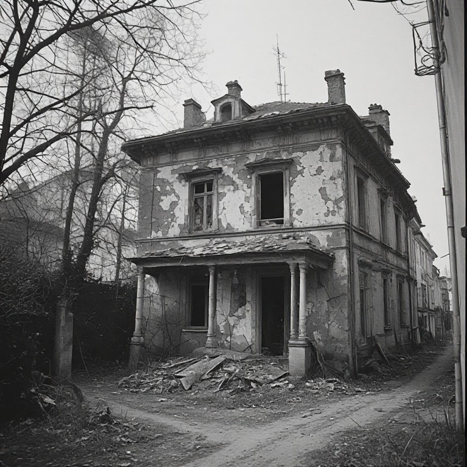
</p>
</div>
:::

### 4.5 Localisation des logements privés vacants depuis plus de deux ans par rapport au zonage (ville centre, périphérie)
::: {style="font-family: YACkoD1yZN0-0;font-size:1.1em;"}
Afin de mieux cibler les actions des services de l’État et des collectivités en faveur de la remise sur le marché des logements vacants de longue durée, trois zones de localisation ont été définies :  

<div style="padding-left: 25px;">
• une zone centre, située dans l’enveloppe urbaine du territoire et à moins de 500 mètres d’un point d’intérêt ;  

• une zone péri-centre, également située dans l’enveloppe urbaine, mais comprise entre 500 mètres et 1 kilomètre d’un point d’intérêt ;  

• une zone hors agglomération, correspondant aux secteurs situés en dehors de ces deux premières zones.  
</div>  

La méthodologie précise de définition de ces trois catégories est présentée en annexe 3.  

```{=html}
<br>
<div class="container6" style="margin:20px 0 40px;">
  <h5 style="text-align:center;">Localisation des logements vacants</h5>

  <div class="controls6">
    <input type="text" placeholder="Rechercher un département…" id="search6" oninput="render6()" />
    <select id="sort-col6" onchange="render6()">
      <option value="dep">Département</option>
      <option value="c1_nb">Classe 1 Nb</option>
      <option value="c1_pct">Classe 1 %</option>
      <option value="c2_nb">Classe 2 Nb</option>
      <option value="c2_pct">Classe 2 %</option>
      <option value="c3_nb">Classe 3 Nb</option>
      <option value="c3_pct">Classe 3 %</option>
    </select>
    <select id="sort-dir6" onchange="render6()">
      <option value="asc">↑ Croissant</option>
      <option value="desc">↓ Décroissant</option>
    </select>
  </div>

  <div class="table-wrap6">
    <table class="table6">
  <thead>
<tr>
  <th rowspan="2" onclick="sortBy6('dep')">Département</th>
  <th colspan="2">Classe 1<br><small>Zone Centre</small></th>
  <th colspan="2">Classe 2<br><small>Zone Péri-centre</small></th>
  <th colspan="2">Classe 3<br><small>Hors agglomération</small></th>
</tr>
<tr>
  <th style="text-align:center;">Nb</th><th>%</th>
  <th>Nb</th><th>%</th>
  <th>Nb</th><th>%</th>
</tr>
  </thead>
  <tbody id="tbody6"></tbody>
</table>
  </div>
</div>

<style>
  .container6 { max-width: 1100px; margin: 0 auto; }
  .controls6 { display: flex; gap: 12px; margin-bottom: 1rem; flex-wrap: wrap; }

  .table-wrap6 { overflow-x: auto; border: 0.5px solid #e0dfd8; border-radius: 12px; background: #fff; }

  .table6 { width: 100%; border-collapse: collapse; font-size: 13px; table-layout: fixed; }

  .table6 th, .table6 td {
    padding: 6px 8px;
    border-bottom: 0.5px solid #e0dfd8;
    text-align: center;
    width: 90px;
  }

  .table6 th:first-child, .table6 td:first-child {
    text-align: left;
    width: 180px;
  }

  .table6 thead tr:first-child th { background:#f1efe8; }
  .table6 thead tr:nth-child(2) th { background:#f7f5ee; }

  /* Alternance 1 ligne sur 2 */
  .table6 tbody tr:nth-child(odd):not(.total-row6) { background:#faf9f5; }
  .table6 tbody tr:nth-child(even):not(.total-row6) { background:#a49b79; }

  .table6 tr:hover:not(.total-row6) td { background:#f9f9f7; }

  .table6 .total-row6 td { font-weight:600; background:#f1efe8; }
</style>

<script>
const raw6 = [
  {dep:"Charente", c1_nb:5471, c1_pct:50.10, c2_nb:1583, c2_pct:14.50, c3_nb:3867, c3_pct:35.40},
  {dep:"Charente-Maritime", c1_nb:7289, c1_pct:50.56, c2_nb:2502, c2_pct:17.36, c3_nb:4625, c3_pct:32.08},
  {dep:"Corrèze", c1_nb:5576, c1_pct:49.04, c2_nb:1503, c2_pct:13.22, c3_nb:4291, c3_pct:37.74},
  {dep:"Creuse", c1_nb:3781, c1_pct:40.65, c2_nb:892,  c2_pct:9.59,  c3_nb:4628, c3_pct:49.76},
  {dep:"Dordogne", c1_nb:6986, c1_pct:44.61, c2_nb:2427, c2_pct:15.50, c3_nb:6248, c3_pct:39.90},
  {dep:"Gironde", c1_nb:13141,c1_pct:54.29, c2_nb:3917, c2_pct:16.84, c3_nb:7147, c3_pct:28.88},
  {dep:"Landes", c1_nb:4377, c1_pct:45.76, c2_nb:1970, c2_pct:20.59, c3_nb:3219, c3_pct:33.65},
  {dep:"Lot-et-Garonne", c1_nb:7088, c1_pct:56.57, c2_nb:1880, c2_pct:15.00, c3_nb:3562, c3_pct:28.43},
  {dep:"Pyrénées-Atlantiques", c1_nb:8836, c1_pct:64.53, c2_nb:2123, c2_pct:15.51, c3_nb:2723, c3_pct:19.86},
  {dep:"Deux-Sèvres", c1_nb:4436, c1_pct:56.52, c2_nb:894,  c2_pct:11.39, c3_nb:2893, c3_pct:32.08},
  {dep:"Vienne", c1_nb:6122, c1_pct:53.91, c2_nb:1416, c2_pct:12.47, c3_nb:3829, c3_pct:33.72},
  {dep:"Haute-Vienne", c1_nb:6479, c1_pct:49.71, c2_nb:1189, c2_pct:9.12,  c3_nb:5366, c3_pct:41.17}
];

let currentSort6 = "dep";
let currentDir6  = "asc";

function sortBy6(col) {
  if (currentSort6 === col) currentDir6 = currentDir6 === "asc" ? "desc" : "asc";
  else { currentSort6 = col; currentDir6 = "asc"; }
  document.getElementById("sort-col6").value = col;
  document.getElementById("sort-dir6").value = currentDir6;
  render6();
}

function render6() {
  const q   = document.getElementById("search6").value.toLowerCase();
  const col = document.getElementById("sort-col6").value;
  const dir = document.getElementById("sort-dir6").value;

  let rows = raw6.filter(r => r.dep.toLowerCase().includes(q));

  rows.sort((a,b) => {
    if (col === "dep") return dir === "asc"
      ? a.dep.localeCompare(b.dep,"fr")
      : b.dep.localeCompare(a.dep,"fr");
    return dir === "asc" ? a[col] - b[col] : b[col] - a[col];
  });

  const tbody = document.getElementById("tbody6");
  tbody.innerHTML = rows.map(r => `
    <tr>
      <td>${r.dep}</td>
      <td>${r.c1_nb.toLocaleString("fr-FR")}</td><td>${r.c1_pct.toFixed(2)}%</td>
      <td>${r.c2_nb.toLocaleString("fr-FR")}</td><td>${r.c2_pct.toFixed(2)}%</td>
      <td>${r.c3_nb.toLocaleString("fr-FR")}</td><td>${r.c3_pct.toFixed(2)}%</td>
    </tr>
  `).join("");

  <!-- tbody.innerHTML += ` -->
  <!--   <tr class="total-row6"> -->
  <!--     <td>Total</td> -->
  <!--     <td colspan="6"></td> -->
  <!--   </tr> -->
  <!-- `; -->
}

render6();
</script>

<div style="font-size:0.8em; color:gray; margin-top:-32px;">
Enveloppe urbaine : zone constituée par un bâti continu.
Points d’intérêt retenus : mairies, lieux de culte et écoles maternelles et élémentaires.
</div>
<br>
```

À l’échelle régionale, 51,7 % des logements privés vacants depuis plus de deux ans sont situés en zone centre et 14,3 % en zone péri-centre. Au total, 66 % du parc vacant de longue durée, soit environ les deux tiers, se situe donc à moins d’un kilomètre d’un point d’intérêt.  

Cette concentration dans les secteurs centraux ou péricentraux est toutefois inégale selon les départements. Elle est particulièrement marquée dans les Pyrénées-Atlantiques (80 %), le Lot-et-Garonne (71,6 %) et la Gironde (69,1 %). À l’inverse, elle est plus faible dans la Creuse (50,2 %), la Haute-Vienne (58,8 %) et la Dordogne (60,1 %).  

Ces résultats montrent qu’une part importante de la vacance longue se situe dans des secteurs déjà urbanisés et relativement proches des centralités et équipements, ce qui peut constituer un enjeu prioritaire de mobilisation du parc existant. Cette localisation ne préjuge toutefois pas, à elle seule, de la facilité de remise sur le marché des logements concernés.
:::

## 5. La vacance résiduelle du parc social (source RPLS)
::: {style="font-family: YACkoD1yZN0-0;font-size:1.1em;"}

La vacance sur le parc social de plus de deux ans, extrêmement marginale, ne concerne que 948 logements selon LOVAC et sur toute la région, en 2024. Il s’agit en écrasante majorité de logements construits dans les années 50 à 70, petits ou moyens (T1 à T3), quasiment toujours des appartements à une exception près (sur La Rochelle : 28 maisons vacantes).  

Dans certains cas, il peut s’agir de logements vacants dans l’attente d’une restructuration ou d’une démolition mais qualifiés comme vacants dans RPLS.  

Il y a 9 communes sur lesquelles il y a de 19 à 108 logements vacants représentant ainsi un potentiel (très modéré) de logements t à remettre sur le marché s’il ne s’agit pas de logements en restructuration : Limoges avec 108 LLS vacants, Poitiers avec une soixantaine d’appartements, Niort et La Rochelle avec une quarantaine de logements HLM vacants, Angoulème avec 25 logements, et de quelques plus petites communes : Saint-Junien, Saint-Jean-d’Angely, Blanquefort et Aubusson (ces deux dernières communes comptant presque 50 logements vacants. C’est un stock relativement notable pour des petites communes. Ces cas de figure ne méritent pas une étude approfondie mais peuvent être relevés.  40 % des logements vacants depuis plus de deux ans de la région sont situés sur ces 9 communes citées.

```{=html}
<table class="vacance-table">
  <thead>
    <tr>
      <th>communes</th>
      <th>Nb de lgts vacants +2 ans du parc social</th>
    </tr>
  </thead>

  <tbody>
    <tr><td>LIMOGES</td><td>108</td></tr>
    <tr><td>POITIERS</td><td>60</td></tr>
    <tr><td>BLANQUEFORT</td><td>48</td></tr>
    <tr><td>AUBUSSON</td><td>47</td></tr>
    <tr><td>NIORT</td><td>42</td></tr>
    <tr><td>LA ROCHELLE</td><td>38</td></tr>
    <tr><td>ANGOULEME</td><td>25</td></tr>
    <tr><td>SAINT-JUNIEN</td><td>22</td></tr>
    <tr><td>SAINT-JEAN-D'ANGELY</td><td>19</td></tr>
  </tbody>
</table>

Autres chiffres de comparaison (6 communes suivantes)
<table class="vacance-table">
  <thead>
    <tr>
      <th>communes</th>
      <th>Nb de lgts vacants +2 ans du parc social</th>
    </tr>
  </thead>
  <tbody>
    <tr><td>LAVAVEIX-LES-MINES</td><td>12</td></tr>
    <tr><td>BORDEAUX</td><td>10</td></tr>
    <tr><td>CROCQ</td><td>9</td></tr>
    <tr><td>COULOUNIEIX-CHAMIERS</td><td>9</td></tr>
    <tr><td>ROCHEFORT</td><td>8</td></tr>
    <tr><td>CREYSSE</td><td>8</td></tr>
  </tbody>
</table>


```

:::